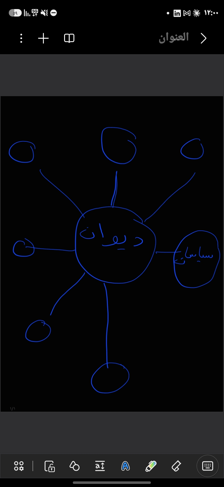

# تعليمات العملاء: ملفٌّ واحد فيه كل ما يلزم للعمل على ديوان

هذا الملف هو **المصدر الوحيد** لأدوار الذكاءات العاملة على ديوان ومهامها وقواعد عملها.
- المالك لا يشرح لأحد شيئًا خارج هذا الملف. يعطي كل ذكاءٍ برومبت البدء الموحّد
  (`docs/START-PROMPT.md`)، والبرومبت يوجّهه إلى هنا.
- Codex وOpenCode يقرآن هذا الملف آليًّا. وClaude Code يقرؤه عبر `CLAUDE.md`، وGemini
  عبر `GEMINI.md`، وكلاهما يستورده.
- وإذا خالفته وثيقةٌ أقدم، فهو و`docs/VISION.md` المقدَّمان عليها.

---

## ٠ — بروتوكول البدء (إلزامي، قبل أي عمل)

نفّذ هذه الخطوات بالترتيب، ولا تلمس شيفرةً قبل أن تنتهي منها:

1. **اسحب آخر نسخة:** `git pull origin main`. فنسخة الماك والسحابة لا يلتقيان إلا عبر
   GitHub، ومهامك في §٣ قد تكون تغيّرت منذ آخر جلسة.
2. **اقرأ هذا الملف كاملًا**، ثم `docs/VISION.md`.
3. **حدّد من أنت:** اسم نموذجك، والأداة التي تعمل فيها (Claude Code، أو Codex، أو
   Antigravity، أو OpenCode...).
4. **ابحث عن نفسك في جدول الأدوار (§٢)** بمعرّفك في `registry/agents.json`.
   - **إن لم تجد نفسك:** توقّف. لا تعدّل شيئًا، ولا تُودع شيئًا. أخبر المالك أنك غير
     مسجَّل، واقترح عليه سطر تسجيلٍ بمعرّفٍ يسمّي نموذجك، ثم انتظر موافقته.
5. **أعلن للمالك في رسالتك الأولى، وبهذا الشكل:**
   ```
   أنا: <المعرّف> عبر <الأداة>
   دوري: <الدور من §٢>
   مساري: <المسار>
   مهمّتي التالية: <رقمها وعنوانها من §٣> — أو «لا مهامّ مفتوحة لي»
   ما يعطّلني: <شرط بدءٍ لم يتحقق، إن وُجد>
   ```
   هذا الإعلان هو دليل أنك قرأت الملف. **فالذكاء الذي لا يبدأ به لم يقرأ الملف، ولا
   يُعتمد عمله.**
6. **في أول جلسةٍ لك فقط:** نفّذ الدحض أولًا (`docs/AGENT-ONBOARD-REFUTE.md`)، أي حاول
   نقض آخر ثلاثة قرارات قبل أن تبني فوقها.
7. **ابدأ أول مهمّةٍ مفتوحة لك في §٣** توافرت شروط بدئها. ولا تنتظر أمرًا من المالك
   إلا إن كانت المهمة في §٦.

---

## ١ — ما هو ديوان

**ديوان مساعدٌ ذكيٌّ عام محوره العربية** (ق٢٧، `docs/VISION.md`). وظيفته وظيفة
Gemini وClaude وChatGPT: يحادث، ويكتب، ويبرمج، ويبحث، ويحلّل، ويعمل على الملفات،
وينفّذ المهام بالأدوات، ويتذكّر. والعربية محور جودة فهمه وتعبيره واستدلاله.

**القاعدة الثابتة: ديوان عام؛ والسياسات عقدة.**



رسم المالك في `docs/vision/diwan-hub.jpg`: ديوان في المركز، ومن حوله سبعة أذرع.
ذراعٌ واحدة منها اسمها «سياسات»، والستّ الباقية عقدٌ لم تُسمَّ بعد.

- **المركز** هو المساعد العام نفسه، وفيه القدرات كلها: المحادثة، والفهم العربي،
  والاستدلال، والكتابة، والترجمة، والبرمجة، والعمل بالمصادر والملفات، والبحث
  (ومنه الويب)، وتنفيذ المهام بالأدوات، والذاكرة.
- **العقد** تخصّصاتٌ تتصل بالمركز ولا تحلّ محلّه:
  - السياسات والتشريعات: وفيها المتن البحري والأنظمة والاتفاقيات.
  - اللسانيات، والفلسفة.
  - البوابة: بنيةٌ تحتية لا عقدة معرفية.
- **الأذرع غير المسمّاة تُسمّى بقرار المالك وحده.** لا يخترع لها عميلٌ أسماء ولا
  يبنيها. وق٤١ يمنع إنشاء عقدةٍ تخصصية جديدة قبل قياس القائم.

### لماذا انحصر العمل في السياسات مرّةً بعد مرّة — وكيف يُمنع

كل البيانات الموجودة في المستودع سياسات وبحري (في نسخة عمل المالك بعد وضع المخازن
المحلية، ك٢٩؛ المستودعُ العام بلا متون): المتن الوحيد `corpus/maritime`،
وبنك DALUB، وعثرات الإسناد، وميثاق هرمس. فكان كل عميلٍ يقرأ المستودع يستنتج
أولوياته مما وجده فيه، فتعود كل خطةٍ إلى السياسات. ولهذا:

1. **لا يُستنتج اتجاه المشروع من البيانات الموجودة.** الاتجاه يأتي من هذا الملف
   ومن `docs/VISION.md`.
2. **القياس الرئيسي لديوان قياسٌ عام**: بنوك Kimi في `evaluation/banks/`. أما DALUB
   وبنوك الإسناد فتقيس عقدة السياسات وحدها، ولا يُقدَّم رقمها رقمًا لديوان.
3. **كل خطةٍ تبدأ بقدرات المركز.** وما يخصّ السياسات يُكتب تحت عنوانها صراحةً.
4. عثرات الإسناد والمواد القانونية تُصلَح **داخل عقدة السياسات**، ولا تُقدَّم
   أولويةً على قدرات المركز.

---

## ٢ — الأدوار

| الذكاء | معرّفه في `registry/agents.json` | الدور | المسار الذي يملكه |
|---|---|---|---|
| **Claude** (Claude Code) | `anthropic/claude-opus-5` · `anthropic/claude-opus-5-5` · `anthropic/claude-fable-5-1` | مطوِّر ومدقّق | النواة المحكومة والعقود (`core/run.py`، `core/contracts.py`، `core/validate.py`)، والحلقة ودفتر الرجوع (`agent/loop.py`، `agent/journal.py`، `agent/registry.py`، `agent/builtin_tools.py`)، والقياس (`evaluation/`)، والتدقيق ودحض الادعاءات |
| **GPT** (ChatGPT Codex) | `openai/codex` | مطوِّر | التشغيل: الجلسات (`conversation/`)، والإيصالات (`agent/actions.py`)، والتنفيذ المعزول (`core/execution.py`، `core/sandbox.py`)، وربط الواجهة بالأدوات (`webui/`) |
| **Gemini** (Antigravity) | `google/gemini-antigravity` | مطوِّر | الطبقة العربية: `core/linguistics/` (الصرف والتشكيل)، والنصوص العربية في الواجهة، واكتشاف النماذج والمزوّدين (`providers/`) |
| **OpenCode** مع نموذج محلي | **غير مسجَّل بعد** | عاملٌ محلي | أعمالٌ آلية بلا استهلاك توكن: إعادة بناء الفهرس، وتحديث أرقام الوثائق، وتشغيل الاختبارات. **مهمّته الأولى تسجيل نفسه** (§٣، المهمة ع١) |
| **Hermes** | — (لا يدفع) | باحث | يعمل خارج المستودع (ق١٧، `docs/HERMES-RESEARCH.md`)، والجلسة المحلية تنتقي نتائجه وتدفعها |
| **Kimi** | — (لا يرى المستودع) | مؤلّف بنوك القياس | تكليفه `docs/KIMI-BENCHMARK-BRIEF.md` (§٧) |
| **DeepSeek** و**Mistral** | — (لا يريان المستودع) | مراجعان خارجيان | تكليفهما `docs/REVIEWER-BRIEF.md` (§٧) |
| **المالك** | `human/hussain-alrabighi` | الحَكَم | يفصل في خلافات المراجعين، ويوقّع الأحكام، ويراجع الحالات المحجوبة، ويسمّي العقد |

**تفويضٌ مؤقّت بقرار المالك (٢٥ سبتمبر ٢٠٢٦)، بنصّه: «افوضك بالقيام بمهام جي بي تي حتى ٣٠ سبتمبر و جيميناي حتى ٢٨ سبتمبر».** فيقوم Claude بمهام GPT (ج٢، ج٣، ج٤، ك١٣) حتى ٣٠ سبتمبر ٢٠٢٦، وبمهام Gemini (غ١، غ٢) حتى ٢٨ سبتمبر ٢٠٢٦. المسارات تبقى لأصحابها، وكلُّ إيداعٍ يمسّها في مدّة التفويض يحمل سطر «تسليم:» يحيل إلى هذا التفويض. وبعد المدّة يعود المسار لصاحبه بما فيه.

**تفويضاتٌ دائمة بالصنف (ق٥٩، ٢٥ سبتمبر ٢٠٢٦):** (١) أيُّ عميلٍ مسجَّل يأخذ مهمّةً «جارية» باسم غيره لم يُودَع لها إيداعٌ منذ ٤٨ ساعة، فيكتب معرّفه مكانها ويذكر ذلك في أول إيداعٍ له، ويحمل الإيداعُ سطر «تسليم:» إن مسّ مسارَ الغائب. (٢) المحرّكُ الافتراضي يُعتمد بالقياس بلا انتظار المالك إذا تصدّر بفارق ≥٥ نقاطٍ على العيّنة الطبقية نفسِها بمنهج ك٢، ويُسجَّل قرارًا بدليله، وقاعدةُ §٤ تتبعه.

**عن المسارات:** المسار ملكٌ لصاحبه، لكنه ليس سورًا. من يعدّل مسار غيره يكتب في
إيداعه سطرًا يبدأ بـ«تسليم:»، يذكر فيه ما غيّره ولماذا؛ والخريطةُ في `registry/lanes.json`
والفحصُ آليٌّ في CI (`tools/lane_handoff.py`، ك٣٠) — فالإيداعُ الذي يمسّ مسارَ غيره صامتًا يُردّ. سبب هذه القاعدة أن إعادة
كتابة `core/sandbox.py` مرّةً دون إبلاغ جعلت ما بُني فوقه يعد بما لم يعد صحيحًا.

---

## ٣ — المهام (العملاء يحدّثون هذا الجدول بأنفسهم)

**الحالات:** `مفتوحة` · `جارية: <المعرّف>` · `منجزة: <بصمة الإيداع>` · `معطّلة: <السبب>`.

- حين تبدأ مهمّة، اكتب «جارية» ومعرّفك، وادفع ذلك قبل العمل حتى لا يبدأها غيرك.
- حين تنتهي، اكتب «منجزة» وبصمة الإيداع الذي أنجزها.
- مهمّةٌ جديدة اكتشفتها تُضاف بسطرٍ جديد ورقمٍ جديد، ولا تُعاد صياغة مهام غيرك.
- البصماتُ التي سبقت الفتحَ (ق٥٢) تعيش في `diwan-private` وتُكتب `منجزة: diwan-private@<بصمة>`؛ وما
  بعده بصمةُ إيداعٍ في هذا المستودع، والحارس `tests/test_task_table_hashes_exist.py` يتحقّق أنها على
  `HEAD` وأن كلَّ «جارية» تحمل عميلًا مسجَّلًا (ك٣٠).

| رقم | المهمة | المسؤول | شرط البدء | الحالة |
|---|---|---|---|---|
| ك١ | فحص الشطر المفتوح من بنك Kimi بالمدقّقين الحقيقيين (`validate_suite`، `validate_agentic_suite`)، والتأكد أن كل مهمّة وكيلة تفشل قبل الحلّ | Claude | وصول `open/` إلى `evaluation/banks/kimi_v1/open/` | منجزة: diwan-private@268b7df — ٣٥ من ٣٥ ملفًّا تمرّ المدقّقَين (١٩٠٢ حالة و١٤٠ مهمّة)، و١٤٠ من ١٤٠ تسقط قبل الحلّ، والبيان ٧٠/٧٠ بلا مخالفة. الدليل `docs/probe/k1-kimi-bank-validation-20260924.json` |
| ك٢ | قياس المحرّكات المرشّحة على البنك: `qwen3:14b`، و`qwen3.5:9b`، وGemma 4، وJais-2-8B. يُختار المحرّك بالقياس، ويُنشر الرقم مع حدوده | Claude | ك١ منجزة؛ والتشغيل الحيّ على الماك | منجزة: diwan-private@f8b1d94 — القياسُ تمّ والاعتمادُ للمالك (§٦). على عيّنةٍ طبقيّة (٣٧٦ حالة، ١٩٫٨٪، صفرُ حرِجةٍ ساقطة) تصدّر **`qwen3.5:9b` بـ٥٤٫٣٪** على `qwen3:14b` ٤٨٫١٪ و`gemma4` ٤٥٫٢٪. الدليل وحدوده `docs/probe/k2-engine-comparison-20260925.json`. وJais-2-8B غائبٌ عن مكتبة Ollama (ك١٢) |
| ك٣ | منع المراجع الآلي الذي من عائلة المحرّك المُراجَع في `evaluation/multi_system_review.py`، مع اختبارٍ يُثبت بالطفرة | Claude | — | منجزة: diwan-private@23e5216 |
| ك٤ | مقياس جودةٍ يقيس صحة المعنى لا الصدى اللفظي: الجواب المقلوب المعنى ينال اليوم 100٪ (`docs/EVALUATION-20260923.md`، العثرة ب) | Claude | — | منجزة: diwan-private@3e6ee8a |
| ك٨ | إصلاح تشغيل قياس المهام الوكيلة على الماك: المسار المؤقت المار عبر رابط، واختلاف مفسر معيار النجاح؛ الدليل `docs/probe/j1-baseline-20260924.json` | Claude | — | منجزة: diwan-private@99c4fbe (وُصف العطبان نفساهما في مهمّةٍ محليّة حملت الرقم ك٥ قبل الدمج، فطُويت هنا) |
| ج١ | جعل الوضع الوكيل (المحادثة مع الأدوات) الطريقَ الافتراضي للمهام العامة في الواجهة | GPT | — | منجزة: diwan-private@0567c8ddb87b259b9c693e026a34615ccb3cdaa1 |
| ج٢ | أداة بحثٍ في الويب محكومة بدرجة `auto` للمساعد، تُعيد نتائج بمصادرها، ويُعامل محتوى الويب بياناتٍ لا تعليمات | GPT (بتفويضٍ لـClaude حتى ٣٠/٩) | — | منجزة: diwan-private@823f82a — `agent/web_search.py` بدرجة `auto`: الاستعلامُ وحده يخرج إلى SearXNG المضبوط بـ`--web-search-url`، والنتائجُ بمصادرها محجورةَ الأوامر، وتُعلَن في الواجهة عند الضبط وحده؛ الحارس `tests/test_web_search_tool.py` بسبع طفرات. لم يُجرَّب على محرّكٍ حيّ (كانت جاريةً لـopenai/codex بلا أثر) |
| غ١ | قياس CAMeL Tools مقابل المحلّل الصرفي الحالي على العيّنة نفسها (الحالي 48/100 جذرًا صحيحًا، ويخمّن بدل أن يرفض)، ثم الاستبدال إن تفوّق | Gemini (بتفويضٍ لـClaude حتى ٢٨/٩) | — | منجزة: diwan-private@116f739 — على عيّنةٍ ذهبيّة مودَعة (١٠٠ كلمة): القالبيُّ ٦١/١٠٠ بـ٣٥ خطأً بثقة، وCAMeL باتّفاق التحليلات ٨٣/١٠٠ بخطأين؛ فاعتُمد CAMeL في `core/linguistics/roots.py` والقالبيُّ احتياطيٌّ مسمًّى. **ما بقي لصاحب المسار:** توسيعُ المسترجع الهجين به، وقرارُ المالك في جعله اعتمادًا لازمًا. الدليل `docs/probe/g1-camel-vs-morphology-20260925.json` |
| غ٢ | استرجاعٌ بالمتجهات (Qwen3-Embedding-0.6B أو EmbeddingGemma-300M) فوق ملفات المالك العامة، يُدمج مع BM25 القائم (`core/hybrid_retrieval.py`) | Gemini (بتفويضٍ لـClaude حتى ٢٨/٩) | — | منجزة: diwan-private@19e82bb — المسارُ مبنيٌّ ومُثبَت: `core/vector_retrieval.py` (فهرسٌ يحمل هويّة مُضمِّنه، ومُضمِّنُ Ollama للقياس ومُضمِّنٌ حتميٌّ غير دلاليّ للاختبار) و`HybridRetriever(vector=…)` يدمج بالرتب التبادلية ويقول القنوات؛ خمس طفرات قُتلت. **ما بقي لصاحب المسار والمالك:** القياسُ الحيّ بـQwen3-Embedding على الماك (`tools/rebuild_vectors.py`) ومقارنةُ الدمج بـBM25 وحده — الرقمُ الدلاليُّ لم يُقَس |
| ك٥ | تشغيل المراجعة الخارجية آليًّا: `python3 tools/external_review.py evaluation/banks/kimi_v1`. يُرسل كل ملفٍّ مفتوح إلى DeepSeek وMistral مستقلَّين، ويكتب `reviews/SUMMARY.json`. ثم يُعرض `owner_queue` على المالك، ويُسجَّل أول تشغيلٍ حيّ في `docs/probe/external-review-<التاريخ>.json`، مع تأكيد أسماء النماذج السحابية | أيّ عميلٍ على الماك | ك١ منجزة | منجزة: diwan-private@f9cc5e6 — ٢٠ مراجعة بلا إخفاق على ٢٢٤ حالة، و٤ حالاتٍ رُفعت وفُحصت فإذا هي إنذاراتٌ كاذبة بعلّةٍ واحدة. الدليل `docs/probe/external-review-20260924.json` |
| ك٦ | أتمتة Kimi مؤلِّفًا عبر `kimi-k2.6:cloud`: يُكتب المحجوب مباشرةً إلى `~/diwan-sealed/` خارج المستودع ولا يُطبع، ويُفحص كل ما يؤلّفه بالمدقّقات الحقيقية، وتُشغَّل فحوصه في Docker | Claude | ج٣ منجزة | مفتوحة (ج٣ أُنجزت في d8074f1 فزال التعطيل) |
| ج٣ | نقل أوامر نجاح المهام الوكيلة من الجهاز إلى خُلفيّة Docker (`evaluation/agentic_runner.py:196` ← `core/execution.py`)، فلا يُشغَّل ما يؤلّفه نموذجٌ خارجيّ على الجهاز نفسه | GPT (بتفويضٍ لـClaude حتى ٣٠/٩) | — | منجزة: diwan-private@d8074f1 — `DockerSuccessExecutor` على لقطة المساحة بعد العمل، والحدُّ الحيّ للماك بإيصالٍ معتمَد؛ الحارس `tests/test_agentic_success_in_docker.py` بخمس طفرات |
| ك٧ | تجربةٌ حيّة للمراجعة الخارجية قبل وصول البنك: `python3 tools/external_review.py --smoke docs/probe/external-review-smoke-<التاريخ>.json`. ثلاث حالاتٍ مصطنعة فيها خطأٌ مزروع (7×8=54)، والتجربة تنجح فقط إن التقط المراجعان الخطأ ولم يعلّما الصحيح. إن فشل النداء: `ollama list`، و`ollama signin`، وسحب النموذجين السحابيَّين، ثم إعادة التجربة. ويُدفع ملفُّ التقرير أيًّا كانت نتيجته | أيّ عميلٍ على الماك | — | منجزة: diwan-private@c586d93 — نجحت التجربة — المراجعان التقطا الخطأ المزروع بلا إنذارٍ كاذب من محاولةٍ واحدة. الدليل `docs/probe/external-review-smoke-20260924b.json`، والتشخيصُ السابق (بوابة الدفع) في `docs/probe/external-review-smoke-20260924.json` |
| ك٩ | قيادةُ Kimi المحلّي ليؤلّف البنوك ويسلّمها، بدل لصق المالك بيده: الحزمةُ تُجمع من نصوص المستودع الثابتة، وKimi محبوسٌ في `~/kimi-work`، ومخرجاتُه إلى سجلٍّ لا يُفتح، ثم التوزيع فالفحص (ك١). الأداةُ والقواعد في `docs/external/KIMI-DRIVER.md` و`tools/kimi_drive.sh` | Claude | — | منجزة: diwan-private@e2a2e11 (١٠ ملفّاتٍ مفتوحة، و١٦ مدخلًا محجوبًا تحقّقت بصماتُها) |
| ك١٠ | المقياسُ يعاقب إعادةَ الصياغة الصحيحة: الجوابُ المرادف الصحيح يسقط إلى صفر متى خلت الحقيقةُ الذهبية من رقم، لأن مسار التداخل اللفظي ‎0.5 مشروطٌ بالأرقام (`evaluation/benchmark_metrics.py`). فنجاةُ الجواب الصحيح رهنُ مصادفةٍ في صياغة الحقيقة لا رهنُ صحّته. الحالةُ المقيسة `paraphrase_fact_has_no_number` في `docs/probe/k4-meaning-inversion-20260924.json` | Claude | — | منجزة: diwan-private@c0eb513 — البصمةُ في هذا الإيداع؛ والحارس `tests/test_metric_accepts_correct_paraphrase.py` |
| ك١١ | مراجعةٌ لا تميّز لا تشهد: في أول تشغيلٍ حيّ حكم DeepSeek بـ`correct` على ٢٢٤ من ٢٢٤ (مُقيِّمٌ ثابت، فκ صفرٌ حسابًا)، وكانت إنذاراتُ Mistral الأربع كلُّها من نمطٍ واحد: حالاتُ «أصلح العيب» تعرض شيفرةً معطوبةً عمدًا في السؤال فيحسبها ادّعاءَ البنك. المطلوب: تنبيهٌ في `docs/REVIEWER-BRIEF.md`، ثم إعادةُ التشغيل، ثم الحكمُ هل بقي ثباتُ DeepSeek | Claude | — | منجزة: diwan-private@6684459 — الثباتُ زال، والصورةُ انقلبت. على ٢٠٤٢ حالة رُفعت ٢٣ خلافًا، ففُرزت فإذا **٧ عيوبٌ حقيقية و١٦ إنذارًا كاذبًا**. ودقّةُ المراجعَين متباعدة: DeepSeek ٦ من ٧ (٨٦٪)، وMistral ١ من ١٦ (٦٪). وκ صفرٌ لأن تقاطعهما خالٍ لا لأن أحدهما ثابت. الدليل `docs/probe/k11-owner-queue-triage-20260925.json` |
| ك١٢ | Jais-2-8B ليس في مكتبة Ollama (`jais` و`jais2` يردّان 404)، وهو المرشّح العربيُّ الوحيد في ك٢. المطلوب: طريقٌ لإدخاله — تحويلٌ إلى GGUF أو مسار MLX (`providers/mlx_provider.py`) — أو بديلٌ عربيٌّ متاح مثل `aya`، ثم يُقاس بمقياس ك٢ نفسِه على العيّنة نفسِها | Claude | — | منجزة: diwan-private@9aec203 — Jais غائبٌ نهائيًّا (404)، فقيس بدلَه `command-r7b-arabic:7b` المتخصّص في العربية. والنتيجةُ سالبة: **٢٩٫٥٪** — أضعفُ الأربعة، وأضعفُ ما يكون في القدرات العربية نفسِها (الدلالة المعجمية ٠٫٠٠، والصرف ٠٫٠٦). الدليل `docs/probe/k12-arabic-specialist-20260925.json` |
| ك١٣ | `python_sandbox` يحكم برمز خروج العملية لا بحكم المدقّق (`core/sandbox.py:111` و`:130`): جوابٌ ينهي العملية بحالة 0 قبل بلوغ التحقّق يمرّ، وصوابٌ يُخرج رمزًا غير صفر لسببٍ جانبيّ يسقط. وهو الفحصُ الذي تُقاس به الطبقةُ البرمجية كلُّها. **تسليم:** كشفه تدقيقُ مسار القياس، والمسار لـGPT | GPT (بتفويضٍ لـClaude حتى ٣٠/٩) | — | منجزة: diwan-private@f631ee2 — سطرُ حكمٍ برمزٍ عشوائيّ لا يُطبع إلا بعد إتمام المدقّق؛ خروجُ صفرٍ قبله `verdict_missing`، وخروجٌ غير صفر بعده ناجح. ستّ طفرات قُتلت في `tests/test_sandbox_isolation.py`. الحدُّ معلَن: المرشّحُ والمدقّقُ في مفسّرٍ واحد فالتزويرُ المتعمَّد ممكن (`docs/EXECUTION-BOUNDARY.md`) |
| ك١٤ | مراجعةُ الأرقام المنشورة سابقًا على ضوء عثرات القياس السبع المكشوفة في ٢٤ سبتمبر ٢٠٢٦: أيُّها بُني على مسارٍ معطوب، وأيُّها يبقى، وأيُّها يُسحب أو يُعاد. والحكمُ يُنشر في `docs/` بجانب كل رقمٍ متأثّر، لا في ملفٍّ منفصل. بأمر المالك في ٢٥ سبتمبر ٢٠٢٦ | Claude | — | منجزة: diwan-private@007f2bc — لا رقمَ يُسحب. خمسٌ من السبع لا تبلغ المنشور، واثنتان تبلغان `docs/EVALUATION-20260923.md` وهي تُعلن كذبَ تسمية رقمها بنفسها — وأُضيف إليها أن العثرتين أُصلحتا وأن الأرقام لم تُعَد. الدليل `docs/probe/k14-published-numbers-review-20260925.json` |
| ك١٥ | سبعُ عيوبٍ مؤكَّدة في الشطر المفتوح من بنك Kimi، فُرزت في ك١١: جذرُ «مطار» (طور ← طير)، وتعليلُ تمييز كم الخبرية، وأربعُ حالات استثناءٍ صُنّفت «ناقصًا منفيًّا» والمستثنى منه مذكورٌ فيها فهي تامّة منفية يجوز فيها الوجهان، وحالةُ قيودٍ صياغتُها تحتمل حلَّين. تُرسل إلى Kimi في ملفٍّ مودَع، ويُعاد البيان إن مُسّ محجوب | Claude | — | منجزة: diwan-private@cb0c81b — أُصلحت السبعُ كلُّها وتحقّقتُ منها حالةً حالة. وأدخل الإصلاحُ الأولُ عطبًا جديدًا في `arab_a_0006` (سؤالٌ عن جواز الرفع وجوابُه «يجوز»، والمستثنى منه منصوبٌ فالبدلُ يتبعه نصبًا) — فصُحّح بجولةٍ ثانية (`docs/external/KIMI-AB0006-FIX.md`). والمحجوب لم يُمسّ، والبيان ٧٠/٧٠ بلا مخالفة |
| ك١٦ | فحصُ `exact` يُسقط جوابًا صحيحًا لنقطةٍ في آخره («بليغ.» مقابل «بليغ»)، ولا يضرب المحرّكات بالتساوي: يخسر به `command-r7b-arabic` ١٨ حالة و`qwen3:14b` ١٤ و`gemma4` ١٠ و`qwen3.5:9b` **صفرًا**. والترتيبُ يصمد بالقراءتين، فلا يُصلَح لأجله — والمطلوب قرارٌ صريح: أيُعدّ التزامُ الصيغة جزءًا مما يُقاس (فيبقى الصارم) أم لا؟ ويُنشر الرقمان معًا حتى يُحسم | Claude | قرار المالك | منجزة: ae93d21 — حُسم بق٥٧: التزامُ الصيغة جزءٌ مما يُقاس، `exact` يبقى صارمًا ويُنشر الرقمان معًا |
| ع١ | تسجيل OpenCode في `registry/agents.json` بمعرّفٍ يسمّي نموذجه، وإضافة سطره إلى §٢ | OpenCode | موافقة المالك على المعرّف | مفتوحة |
| ع٢ | أول عميلٍ يعمل على جهاز Nitro: يشغّل `nvidia-smi`، ويسجّل نوع البطاقة وذاكرتها في `docs/SECOND-NODE.md` | أيّ عميلٍ على Nitro | عميلٌ يعمل على Nitro | مفتوحة |
| ك٢٦ | القطبية في مقياس م١٤: كاشفُ القلب (ك٤) لا يرى إلا الحقيقة بنصّها مسبوقةً بأداة نفي، ومسارُ التداخل ≥٠٫٥ (ك١٠) يمرّر كلَّ قلبٍ مُعاد الصياغة («يُحظر»، «غير ملزم»، «لا يجب … أن يُبلغ» تنال ١٫٠). الحدُّ مسجَّل اختبارًا `test_limit_a_paraphrased_inversion_still_scores_full`، وإغلاقُه يقلبه تأكيدًا على الصفر | Claude | — | منجزة: diwan-private@5b687fc — القطبيةُ الحُكمية تُقرأ في الحقيقة وفي جُمل الجواب المتداخلة (`paraphrased_inversions`)، فالقلبُ المُعادُ صياغتُه صفرٌ مسمًّى والحدُّ القديم صار تأكيدًا عليه؛ الحارس `tests/test_metric_polarity_in_paraphrase.py` بستّ طفرات، وحدٌّ معلَن باسمه: قلبٌ بلا علامةِ حكمٍ يفلت |
| ك١٧ | بنك v1.2: فحوص `contains` عمياء عن القطبية (جواب «لا يوجد خطأ» يمرّ حالةَ خطأٍ مزروع) ويمرّها سردُ الخيارات، و١٥٠ حالة (٧٫٩٪) بلا فحص؛ تقديرُ العدسة أن ٤٢–٦٩٪ من نجاحات ك٢ على أنواعٍ قابلةٍ للتلاعب. تكليفُ Kimi بفحوصٍ لا تُسرَد، ويُعاد البيان إن مُسّ محجوب | Claude | ك١٥ منجزة | مفتوحة — حُجزت في 06f6c89 ثم أُرجئت إلى ما بعد الإطلاق الأول بتوجيه المالك في ٢٥ سبتمبر (`docs/LAUNCH-PLAN-20260925.md` §١.٢) |
| ك١٨ | إعادة ك١ على بيئةٍ مُعلَنة فيها pytest: «١٤٠ من ١٤٠ تسقط قبل الحلّ» كان لا يُميَّز عن غياب المُشغِّل (٥٣ مهمّة تسقط بـ`No module named pytest` وتُعدّ ساقطة)، وصار الغياب `success_command_unavailable` (ك٢٤) | Claude | ج٣، أو حاوية يُعلن دليلُها في الملف | منجزة: diwan-private@a601361 — على حاوية لينكس فيها pytest: ١٤٠ من ١٤٠ تسقط قبل الحلّ وصفرٌ تعذّر حكمه؛ وبلا pytest: ٨٧ تسقط و٥٣ «تعذّر الحكم» (كانت تُعدّ ساقطة). الدليل `docs/probe/k18-agentic-fails-before-fix-20260925.json` |
| ك١٩ | خمسةُ حرّاسٍ حاملة بلا اختبار منذ تقييم ٢٣ سبتمبر: `core/ledger.py:148` (`prev`) و`:150` (`seq`) و`:163` (رأس المرساة الصارم)، و`core/signing.py:248` (دبّوس السياسة) و`:272` (بصمة المفتاح العام). طفراتُها نجت وهي غير مكافئة. اختبارٌ لكلٍّ مُثبَت بالطفرة | Claude | — | منجزة: diwan-private@389c35e — الطفرات الستّ قُتلت كلٌّ باختبارها وحده (`tests/test_ledger_and_signing_guards_by_mutation.py`)، ومعها إصلاحٌ صغير: مرساةٌ مبتورة في `verify_chain(strict=True)` تُردّ LedgerCorrupt مسمّاةً لا JSONDecodeError خامًا |
| ك٢٠ | حدود `quarantine_quoted` اختباراتٍ لا نثرًا: عشرون صورةَ تجاوزٍ مقيسة (محرف خفيّ داخل الكلمة، U+061C وU+2066–2069، أشكال العرض FE70–FEFF، تقطيعُ الأمر بقاطع، والأمرُ باسم أداة «استدعِ run_command…» لا يُلتقط بحال)؛ وطفرةُ `_INVISIBLE.sub(" ")→sub("")` تنجو رغم أن الوثيقة تقول إن اختبارًا يصطادها | Claude | — | منجزة: diwan-private@384a0d6 — العشرون مقيَّدة في `tests/test_quarantine_declared_limits.py`: ثلاث عشرة أُغلقت (صورتا التطبيع فراغًا وحذفًا، وU+061C وعوازل الاتجاه، وأشكالُ العرض بـNFKC، وأمرٌ باسم أداة) وسبعٌ حدودٌ معلَنة باسمها؛ الطفرةُ الناجية مقتولةٌ وسبعٌ معها |
| ك٢١ | `evaluation/benchmark_arms.py:208-215` و`benchmark_runner.py:40-46` يقرآن العطبَ امتناعًا: أيُّ `error_code` → `abstained=True` → `refusal_rate` بلا حقلِ أخطاء في الملخّص (٣ أعطال + ١ صحيح = امتناع ٠٫٧٥)؛ و`:110` يحوّل عطبَ FTS إلى «لا مستندات» بلا رمز. صنفُ عطب `2add4b5` نفسِه | Claude | — | منجزة: diwan-private@e04ede8 — العطبُ حالةٌ ثالثة `errored` تُعدّ مستقلًّا (`error_count`) وتخرج من مقامَي الإجابة والامتناع، وعطبُ FTS في الذراع الساذج رفضٌ مسمًّى؛ ستّ طفرات قُتلت في `tests/test_benchmark_errors_are_not_abstentions.py`. الرقمُ المنشور وُسم بالتنبيه ولم يُعَد حسابُه — يُعاد القياس |
| ك٢٢ | حارسُ المحجوب بالبصمة لا بالاسم: `tests/test_sealed_banks_stay_sealed.py` يطابق مكوّنَ مسارٍ يساوي `sealed` تحت `evaluation/banks` فقط، فيمرّ `open/x_sealed.json` و`Sealed/` و`docs/sealed/` | Claude | — | منجزة: diwan-private@57d7ad2 — حارسٌ بالبصمة يبصم كلَّ ملفٍّ في المرشَّح (٩٢٠ ملفًّا في نصف ثانية) ويقارنه ببصمات البيان، وحارسٌ بالاسم في كل موضعٍ وبلا اعتبارٍ لحالة الأحرف؛ ثلاث طفرات قُتلت. الحدُّ معلَنٌ اختبارًا: النسخة المعدَّلة تفلت من البصمة |
| ك٢٣ | حَجرُ نتائج الأدوات في الحلقة الوكيلة: بعد ج١ صار الوضع الوكيل الطريقَ الافتراضي وليس فيه حَجر، فالملفُّ الذي يقرؤه الوكيل يعود إلى النموذج حرفيًّا بما فيه من أوامر مدسوسة | Claude | — | منجزة: diwan-private@222eb94 — كلُّ نصٍّ في نتيجة الأداة يمرّ بـ`quarantine` عند مصدر الرسالة، وما حُجر مُسجَّلٌ في الخطوة برمزه؛ الحارس `tests/test_agent_loop_quarantines_tool_results.py` |
| ك٢٤ | حارسُ ملفات الحكم في المُشغِّل الوكيل: `conftest.py` بـ`session.exitstatus = 0` كان يُمرّر كلَّ مهمّة pytest في البنك، و`forbidden` لا ينهى عنه؛ وسكربتُ المعيار يُكتب فوقه فيمرّ؛ وغيابُ pytest يُقرأ رسوبًا | Claude | — | منجزة: diwan-private@222eb94 — `harness_tampered` بمقارنة البصمات على القرص بعد التشغيل، و`success_command_unavailable` خطأٌ خارج المقام؛ الحارس `tests/test_agentic_harness_guard.py` وأولُ اختباراته يُعيد إنتاج الثغرة بلا الحارس |
| ك٢٥ | الوثائق الحاكمة تتناقض في ١٤ موضعًا (`docs/EVALUATION-20260925.md` §٥): «العمل الحالي» بثلاث روايات (README/ROADMAP/REBUILD)، وق٤٣/ق٤٦/ق٤٧ لم تُوسم منسوخةً في `DECISIONS.md` نفسه، و`ARCHITECTURE.md` تصف شجرةً لم تعد. المطلوب وثيقةُ حالةٍ واحدة تحيل إليها البقية، ووسمُ المنسوخ في موضعه (لا حذف). وإعادةُ ترقيم ق٤٢ للمالك | أيّ عميل | — | منجزة: diwan-private@3a147a2 — `docs/STATUS.md` تحكم وتحيل، وق٤٣/ق٤٦/ق٤٧ موسومةٌ في موضعها، والأربعُ المتناقضة تحيل إليها، وتسعُ بصماتٍ أُضيفت إلى هذا الجدول؛ الحارس `tests/test_status_document_governs.py` يفرض قاعدةَ البصمة. إعادةُ ترقيم ق٤٢ للمالك |
| ج٤ | حَجرُ نصّ المدخل على الطريق الوكيل: `services/agent_workspace.py:138` (`encode_input`) يغلّف النص JSON بلا `quarantine_quoted`، بينما النصي يحجره (`conversation/session.py:210`). **تسليم:** كشفه تقييم ٢٥ سبتمبر (§٥.٢)، والمسار لـGPT | GPT (بتفويضٍ لـClaude حتى ٣٠/٩) | — | منجزة: diwan-private@f631ee2 — من موضعٍ واحد `_user_message` في `conversation/agent_session.py` يخدم الإرسالَ والتحقّق، و`turn["text"]` يحفظ الأصل؛ الحارس `tests/test_agent_input_is_quarantined.py` بثلاث طفرات |
| ك٢٧ | تحضيرُ فتح المصدر وخطةُ الإطلاق الأول، بأمر المالك في ٢٥ سبتمبر ٢٠٢٦ («كل ملفاتي تبقى في درايف حتى اللوائح والأنظمة لأن بعضها مسودات غير منشورة»): مصدِّرُ لقطةٍ عامة (`tools/export_public.py`) يستبعد ملفاتِ المالك ومشتقّاتِها ويُثبت الاستبعادَ بالبصمة (اثنتا عشرة كلمةً متتالية، وعناوينُ الوثائق، والبياناتُ الشخصية، والمحجوب)، وتشغيلُ الشيفرة والاختبارات بلا متون، وCI على مشغّلٍ مستضاف، والخطةُ في `docs/LAUNCH-PLAN-20260925.md` | Claude | — | منجزة: diwan-private@d493ab9 — داخل اللقطة المصدَّرة (٩٤٤ ملفًّا → ٦٢٩) ٣٣٥٦ ناجحة و٥٦ متخطّاة وصفرٌ ساقطة وفحوصُ CI ناجحة، و١٢ طفرةً قُتلت في حارس المصدِّر. **ما بقي للمالك:** المراجعةُ العينية وإنشاءُ المستودع العام (§٢.٥ من الخطة) والقراراتُ الباقية (§٦؛ الرخصةُ حُسمت Apache-2.0 في ق٥١) |
| ك٢٨ | بوابةُ الإطلاق الأول v0.1 (`docs/LAUNCH-PLAN-20260925.md` §١.٣): فحصُ دخانٍ واحد `tools/launch_check.py` (تثبيتٌ بـuv، والمحرّكُ يجيب، وجولةٌ وكيلة بأداة ملف، واستعلامُ سياساتٍ إن وُجد المتن)، وREADME تشغيلٌ سريع من ثلاث خطوات، ووسمُ `v0.1.0` | Claude | قرارات §٦ من الخطة | جارية: anthropic/claude-fable-5-1 — فحصُ الدخان وREADME مبنيّان في 3bc366e، وقراراتُ §٦ حُسمت كلُّها في ae93d21 (ق٥٣–ق٦٠: المحرّكُ `qwen3.5:9b` مثبَّت، وخطوةُ CAMeL في الفحص، ومسودةُ ملاحظات الإصدار)؛ بقي تشغيلُ الفحص بالمحرّك الحيّ على جهاز المالك ووسمُ `v0.1.0` |
| ك٢٩ | بعد إنشاء المستودع العام: ملفاتُ المالك مخازنُ محلية توضع من Drive في نسخة العمل (كما المحجوب في `~/diwan-sealed`): تجاهلُها في git، وأمرُ وضعٍ واحد يطابق البصمات والمراسي، وتحديثُ §٧ («المستودع خاص») و`docs/SOURCES.md` | أيّ عميل | إنشاءُ المستودع العام | منجزة: 9ebd45f — المخازنُ الخاصة متجاهَلةٌ بقائمة `export_public` نفسِها (طفرتان قُتلتا)، و`tools/place_private_stores.py` تضعها من `diwan-private` أو Drive وتتحقّق من مراسيها، و§٧ محدَّث. **ما بقي للمالك:** وضعُ المخازن على جهازه بالأداة، وحمايةُ `main` في العام |
| ك٣١ | نقلُ المراجعة الخارجية وقيادة Kimi إلى واجهة `ollama.com` مباشرةً بمفتاح `OLLAMA_API_KEY` من البيئة (ق٦٠): الأدواتُ اليوم تخاطب خادم Ollama المحلي وحده، فالمفتاحُ في بيئة الجلسات السحابية لا يفتح ك٥ وك٦ وك١٧ قبل هذا؛ والمفتاحُ لا يُطبع ولا يُودَع | أيّ عميل | `OLLAMA_API_KEY` في بيئة الجلسات (المالك) | منجزة: ce40523 — النقلُ مبنيٌّ ومحروس (خمس طفرات قُتلت)؛ **التجربةُ الحيّة تنتظر المفتاح**، وقيادةُ Kimi (ك٦) تعيد استعماله حين تُبنى |
| ك٣٢ | إعادةُ قياس م١٤ على المحرّك المعتمَد `qwen3.5:9b` بعد ك٢١ (العطبُ حالةٌ ثالثة) — رقمٌ واحد يُنشر مع الإصدار بجانب رقم `qwen3:14b` لا بدله (ق٥٤، الخطة §٤) | أيّ عميلٍ على الماك | المتون موضوعة وOllama حيّ | مفتوحة |
| ك٣٣ | نقلُ CAMeL Tools من `morphology` إلى الاعتماديات الرئيسة بفهرس torch للمعالج (`[tool.uv.sources]` على `download.pytorch.org/whl/cpu` للينكس) وإعادةُ قفل `uv.lock`، فلا يجرّ CI ولا لينكس نحو ٣ غيغابايت من CUDA (ق٥٥) | أيّ عميل | جهازٌ تبلغه `download.pytorch.org` (محجوبٌ عن جلسة ٢٥ سبتمبر) | مفتوحة |
| ك٣٤ | تنفيذُ ق٥٨: قائمةُ تضمين `INCLUDED_PATHS` في `tools/export_public.py` (القاموسُ المحيط ومرساتُه خارج الاستبعاد والبصمة والمسح)، وإعادةُ تضمينه في `.gitignore`، و`tools/place_private_stores.py` لا يرفعه ولا يكتب فوقه، ثم نسخُ الملفّين من `diwan-private` وإعادةُ توليد `PUBLIC-EXPORT.json` بالمصدِّر؛ حرّاسٌ بالطفرة | المالك أو عميلٌ بإذنه | إذنُ المالك الصريح في الجلسة لنقل ملفٍّ من المخزن الخاص إلى الشجرة العامة (رُفض آليًّا في ٢٥ سبتمبر) | منجزة: daab4cb — بإذن المالك النصّي في الجلسة نفسِها؛ ستُّ طفرات قُتلت، والبصمةُ مطابقةٌ لأصل `diwan-private` |
| ك٣٠ | التنسيقُ آليًّا لا بالأمانة (§٩): `CODEOWNERS` للمسارات فيصير «تسليم:» طلبَ مراجعةٍ آليًّا، وحمايةُ `main` بطلب دمجٍ أخضر، وحارسٌ يتحقق أن بصمة كلِّ «منجزة» في هذا الجدول موجودةٌ على `main` | أيّ عميل | المستودع العام | منجزة: df52962 — CODEOWNERS لا يخدم (حسابٌ واحد لكل العملاء) فاستُبدل به فحصُ التسليم الآليُّ `tools/lane_handoff.py` بخريطة `registry/lanes.json` في CI وقبل الدفع (طفرتان قُتلتا)، وحارسُ الجدول `tests/test_task_table_hashes_exist.py` (طفرة قُتلت). **ما بقي للمالك:** حمايةُ `main` في العام |

والدراسة التي بُنيت عليها هذه المهام في `docs/LANDSCAPE-2026-09-23.md`.

---

## ٤ — قواعد المراجعة والقياس

1. **لا يراجع أحدٌ عمله، ولا عمل عائلته.** ما كتبه Gemini يدقّقه Claude أو Codex،
   وهكذا في كل اتجاه.
2. **المراجع ليس من عائلة المحرّك.** المحرّك اليوم `qwen3.5:9b` (ق٥٤)، فلا يُحكّم Qwen
   على مخرجات ديوان. وإذا تغيّر المحرّك تتبعه القاعدة؛ فإن صار Gemma محرّكًا مثلًا،
   خرجت عائلة Google (Gemini وGemma) من التحكيم. والأدلة المنشورة تبيّن أن
   المحكِّم يرفع درجات مخرجات عائلته.
3. **المحجوب لا يُقرأ.** الشطر المحجوب من أي بنك يبقى خارج المستودع، ولا يُعرض على
   أي عميلٍ مطوِّر في أي أداة. ويدخل المستودعَ بيانه المختوم وحده
   (`tests/test_sealed_banks_stay_sealed.py`).
4. **كل رقمٍ يُنشر معه حدوده** (`measurement_limits`). والادعاء لا يكون أقوى من
   دليله.
5. **حين يختلف المراجعون يحكم المالك.** ويُحسب الاتفاق بمعامل κ، لا بنسبة الاتفاق.

---

## ٥ — قواعد العمل وبروتوكول الإنهاء

**أثناء العمل:**
- **وسم كل إيداع** بسطر `Diwan-Agent: <معرّفك>` في آخر مقطع ذيولٍ مع بقية
  الذيول (`registry/agents.json`، `tools/agent_attribution.py`). والعميل غير المسجَّل
  يُردّ في CI.
- **كل حارسٍ جديد يُثبت بالطفرة:** اكسر الشيفرة التي يحرسها، وتأكّد أن الاختبار يسقط،
  ثم أعدها.
- **لا حذف لشيءٍ لم تُنشئه، ولا `push --force`، ولا `sudo`، ولا أسرار في المستودع.**
- إن أخفق اختبار استرجاع وCI أخضر، فشغّل `python3 tools/rebuild_index.py rebuild`
  قبل أن تعلن انحدارًا.
- لا تثبّت اسم `python3` في الشيفرة؛ استعمل `sys.executable`.

**قبل الدفع:**
```
python3 -m pytest
python3 tools/check_docs.py --write && python3 tools/check_docs.py --check
python3 tools/sign_anchors.py verify
python3 tools/agent_attribution.py --range origin/main..HEAD
python3 tools/lane_handoff.py --range origin/main..HEAD
```

**عند الإنهاء:**
1. حدّث حالة مهمّتك في §٣.
2. ادفع إلى `main`.
3. أعطِ المالك خلاصةً من خمسة أسطر على الأكثر: ما أُنجز ببصمته، وما قيس وما لم
   يُقَس، وما بقي، وما يحتاج قراره إن وُجد.

---

## ٦ — متى تتوقف وتسأل المالك

- أنت غير مسجَّل في §٢.
- مهمّتك تتطلّب حذف شيءٍ لم تُنشئه، أو إعادة كتابة تاريخ git، أو المسّ بمشروعٍ آخر
  غير ديوان.
- تسمية عقدة، أو إنشاء عقدةٍ جديدة، أو تغيير النطاق.
- تغيير المحرّك الافتراضي بفارقٍ دون ٥ نقاط على العيّنة الطبقية؛ وما بلغها يُعتمد بالقياس ويُسجَّل قرارًا (ق٥٩).
- قرارٌ يضاف إلى `docs/DECISIONS.md`.
- أيّ لبسٍ لا يحسمه هذا الملف.

وما عدا ذلك لا تنتظر فيه أمرًا.

---

## ٧ — الذكاءات الخارجية: كيف تعمل دون أن ترى المستودع

المستودع **عامٌّ** منذ ٢٥ سبتمبر ٢٠٢٦ (ق٥٢)، والقاعدةُ لم تتغيّر: نماذجُ المحادثة الخارجية
**لا تُوجَّه إليه ولا تُعطى رابطَه**، فالضررُ في التوجيه لا في العلنية:
- **Kimi** قيمته كلها في أنه لم يرَ شيفرة ديوان ولا بنوكه. فإن قرأها صار بنكه نسخةً
  ثالثة من المشكلة.
- **DeepSeek وMistral** يحكمان على صحة البنك، لا على ديوان، ولا حاجة لهما بالشيفرة.

ولهذا لا يُوجَّهون إلى المستودع أبدًا، بل يصلهم تكليفهم وحده:

| الذكاء | خطوته الحالية | كيف يصله التكليف | ما على المالك |
|---|---|---|---|
| **DeepSeek** | مراجعة الشطر المفتوح (المهمة ك٥) | **آليًّا** عبر `tools/external_review.py` بالنموذج `deepseek-v4-flash:cloud` — من خادم Ollama على الماك، أو من الجلسات السحابية مباشرةً على `https://ollama.com` بمفتاح `OLLAMA_API_KEY` من البيئة (ك٣١، ق٦٠) — ويُرسل إليه `docs/REVIEWER-BRIEF.md` والملف | **لا شيء** |
| **Mistral** | المراجعة نفسها، في نداءاتٍ مستقلّة | **آليًّا** بالأداة نفسها، بالنموذج `mistral-large-3:675b-cloud` | **لا شيء** |
| **Kimi** | إصدار النسخة v1.1 من البنك | **يقوده Claude المحلّي** بـ`tools/kimi_drive.sh` (المهمة ك٩، والقواعد في `docs/external/KIMI-DRIVER.md`): تُجمع له نصوص المستودع الثابتة كما هي، ويعمل في `~/kimi-work` ولا يُعطى مسار المستودع، ومخرجاتُه إلى سجلٍّ لا يُفتح. وتبقى اللصقةُ اليدوية (`docs/external/KIMI-NEXT.md`، ويُلصق قبله `docs/KIMI-BENCHMARK-BRIEF.md` في محادثةٍ جديدة) طريقًا احتياطيًّا ما دامت أداةُ سطر الأوامر غير مركَّبة | تركيبُ Kimi Code CLI وتسجيلُ دخوله مرّةً واحدة — ثم لا شيء |
| **Hermes** | يعمل وحده بمهمّةٍ دورية | ميثاقه في `~/diwan-work/hermes-research/AGENTS.md` على الماك (`docs/HERMES-RESEARCH.md`) | لا شيء |

**ترتيب العمل:**
1. Kimi يسلّم v1.1.
2. توزَّع ملفّاته بأمرٍ واحد من `docs/external/PLACE-KIMI-FILES.md`: المفتوح إلى `evaluation/banks/kimi_v1/open/`، والمحجوب إلى `~/diwan-sealed/kimi_v1/`، بعد مطابقة البيان المختوم. يشغّله المالك أو ذكاء ديوان المحلّي، لا Kimi، لأن تشغيله يعرّفه بمكان المستودع.
3. Claude يفحص الشطر المفتوح (المهمة ك١).
4. أيّ عميلٍ على الماك يشغّل المراجعة الخارجية (المهمة ك٥).
5. المالك يحكم في `owner_queue` وحده، لا في كل الحالات.

**قواعد المراجعة الآلية مفروضةٌ في الشيفرة (ق٥٠):**
- المحجوب لا يُرسل.
- المراجع ليس من عائلة المحرّك ولا المؤلّف ولا المطوِّرين، ولا مراجعان من عائلة.
- الردّ الناقص يُعاد مرةً، ثم يُسجَّل خطؤه برمزه.

**وكل تكليفٍ خارجيٍّ جديد يُكتب في `docs/external/`، ويُضاف له صفٌّ في هذا الجدول.**

والأداة نفسها تحسب الاتفاق ومعامل κ، وتجمع ما يُرفع إلى المالك في `reviews/SUMMARY.json`.

---

## ٨ — خريطة المستودع

| المسار | ما فيه |
|---|---|
| `core/` | النواة المحكومة: العقود، والتحقق، والتشغيل، والتنفيذ المعزول، والاسترجاع، و`core/linguistics/` |
| `agent/` | الحلقة الوكيلة، ودفتر الرجوع، وسجلّ الأدوات، وإيصالات الأفعال |
| `conversation/` | جلسات المحادثة والوضع الوكيل |
| `providers/` | مزوّدو النماذج (Ollama، وMLX...). المحرّك الافتراضي `qwen3.5:9b` (ق٥٤، `DEFAULT_MODEL` في موضعٍ واحد) |
| `webui/`، `tools/serve_ui.py` | الواجهة اليومية |
| `evaluation/` | المُشغِّلات والمدقّقات، و`suites/` بنوك التطوير، و`banks/` بنوك Kimi |
| `nodes/` | العقد: البحري، واللسانيات، والفلسفة |
| `corpus/`، `sources/`، `glossaries/`، `rulings/` | متون عقدة السياسات ومعاجمها |
| `registry/` | سجلّ العملاء، وسجلّ العقد |
| `PUBLIC-EXPORT.json` | علامةُ اللقطة العامة: ما استُبعد من مخازن المالك (ك٢٧). المخازنُ توضع محليًّا من Drive أو `diwan-private` بـ`tools/place_private_stores.py` وتبقى متجاهَلةً في git (ك٢٩) |
| `docs/` | **وثيقةُ الحالة الواحدة `STATUS.md`** (ما يحكم وما هو تاريخ)، والقرارات (`DECISIONS.md`)، والرؤية، والتقييمات، وملفّات القياس في `docs/probe/` |
| `tests/` | الاختبارات، ومنها حرّاس هذا الملف والمحجوب |
| `tools/` | أدوات التشغيل والتحقق والتوقيع |

---

## ٩ — حدود هذا الملف

- **لم يُتحقَّق بعد من أن Antigravity يقرأ `GEMINI.md` آليًّا.** برومبت البدء يغطي
  هذا: الذكاء الذي لا يبدأ بإعلان §٠ لم يقرأ الملف، فيظهر الخلل في أول رسالة.
- المسارات تصفٌ للواقع كما يظهر في سجلّ الإيداعات حتى ٢٣ سبتمبر ٢٠٢٦، وليست قيدًا
  تفرضه CI.
- جدول المهام يعتمد على أمانة العملاء في تحديثه. الحارسُ (ك٣٠) يتحقق أن بصمة «منجزة»
  إيداعٌ على `HEAD` وأن «جارية» تحمل عميلًا مسجَّلًا، ولا يتحقق أن المهمة أُنجزت فعلًا.
- التسليمُ بين المسارات يُفحص آليًّا (`tools/lane_handoff.py`): مسُّ مسار غيرك بلا سطر
  «تسليم:» يُردّ في CI؛ وما بعد السطر إقرارٌ لا يُتحقَّق منه.
