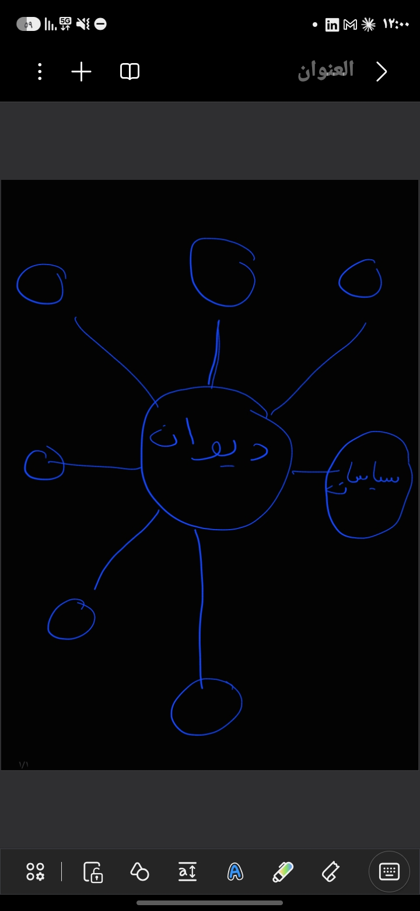

# تعليمات العملاء: ملفٌّ واحد فيه كل ما يلزم للعمل على ديوان

هذا الملف هو **المصدر الوحيد** لأدوار الذكاءات العاملة على ديوان ومهامها وقواعد عملها.
- المالك لا يشرح لأحد شيئًا خارج هذا الملف. يعطي كل ذكاءٍ برومبت البدء الموحّد
  (`docs/START-PROMPT.md`)، والبرومبت يوجّهه إلى هنا.
- Codex وOpenCode يقرآن هذا الملف آليًّا. وClaude Code يقرؤه عبر `CLAUDE.md`، وGemini
  عبر `GEMINI.md`، وكلاهما يستورده.
- وإذا خالفته وثيقةٌ أقدم، فهو و`docs/VISION.md` المقدَّمان عليها.

---

## ٠ — بروتوكول البدء (إلزامي، قبل أي عمل)

نفّذ هذه الخطوات بالترتيب، ولا تلمس شيفرةً قبل أن تنتهي منها:

1. **اسحب آخر نسخة:** `git pull origin main`. فنسخة الماك والسحابة لا يلتقيان إلا عبر
   GitHub، ومهامك في §٣ قد تكون تغيّرت منذ آخر جلسة.
2. **اقرأ هذا الملف كاملًا** (صار دون ٣٢ كيلوبايت بعد أرشفة صفوف §٣ المنجزة)، ثم **`docs/INDEX.md`**: فهرسٌ مولَّد
   يقول لكل وثيقةٍ حاكمة ما فيها ومتى تُقرأ وبصمتَها؛ فلا تفتح وثيقةً أخرى إلا إن سمّاها لمهمّتك أو تغيّرت بصمتُها
   عمّا رأيتَه آخرَ مرّة. و`docs/VISION.md` في أول جلسةٍ لك وعند كلِّ شكٍّ في النطاق (ق٦٧-٥).
3. **حدّد من أنت:** اسم نموذجك، والأداة التي تعمل فيها (Claude Code، أو Codex، أو
   Antigravity، أو OpenCode...).
4. **ابحث عن نفسك في جدول الأدوار (§٢)** بمعرّفك في `registry/agents.json`.
   - **إن لم تجد نفسك:** توقّف. لا تعدّل شيئًا، ولا تُودع شيئًا. أخبر المالك أنك غير
     مسجَّل، واقترح عليه سطر تسجيلٍ بمعرّفٍ يسمّي نموذجك، ثم انتظر موافقته.
5. **أعلن للمالك في رسالتك الأولى، وبهذا الشكل:**
   ```
   أنا: <المعرّف> عبر <الأداة>
   دوري: <الدور من §٢>
   مساري: <المسار>
   مهمّتي التالية: <رقمها وعنوانها من §٣> — أو «لا مهامّ مفتوحة لي»
   ما يعطّلني: <شرط بدءٍ لم يتحقق، إن وُجد>
   ```
   هذا الإعلان هو دليل أنك قرأت الملف. **فالذكاء الذي لا يبدأ به لم يقرأ الملف، ولا
   يُعتمد عمله.**
6. **في أول جلسةٍ لك فقط:** نفّذ الدحض أولًا (`docs/AGENT-ONBOARD-REFUTE.md`)، أي حاول
   نقض آخر ثلاثة قرارات قبل أن تبني فوقها.
7. **ابدأ أول مهمّةٍ مفتوحة لك في §٣** توافرت شروط بدئها. ولا تنتظر أمرًا من المالك
   إلا إن كانت المهمة في §٦.

<!-- generated:context-index:begin -->
> **فهرسُ السياق** (`docs/INDEX.md`، مولَّد بـ`tools/context_index.py`؛ لا يُحرَّر يدويًّا). المفتوحُ من §٣: ك٦ (Claude؛ مفتوحة)، ع٢ (أيّ عميلٍ على Nitro؛ مفتوحة)، ك١٧ (Claude؛ مفتوحة)، ك٣٧ (Claude؛ مفتوحة).
> بصماتُ الوثائق الحاكمة: `docs/STATUS.md` `e3157e9119b4` · `docs/VISION.md` `df9b1b18e0bb` · `docs/DECISIONS.md` `84b0f9d75c75` · `docs/PLAN-20260926.md` `dcf26f95aecd`؛ وآخرُ قرار ق٦٨.
> بصمةٌ تغيّرت عمّا رأيتَه في جلستك السابقة تعني أن الوثيقة تغيّرت فتُقرأ من الفهرس؛ وما لم يتغيّر لا يُعاد.
<!-- generated:context-index:end -->

---

## ١ — ما هو ديوان

**ديوان مساعدٌ ذكيٌّ عام محوره العربية** (ق٢٧، `docs/VISION.md`). وظيفته وظيفة
Gemini وClaude وChatGPT: يحادث، ويكتب، ويبرمج، ويبحث، ويحلّل، ويعمل على الملفات،
وينفّذ المهام بالأدوات، ويتذكّر. والعربية محور جودة فهمه وتعبيره واستدلاله.

**القاعدة الثابتة: ديوان عام؛ والسياسات عقدة.**



رسم المالك في `docs/vision/diwan-hub.jpg`: ديوان في المركز، ومن حوله سبعة أذرع.
ذراعٌ واحدة منها اسمها «سياسات»، والستّ الباقية عقدٌ لم تُسمَّ بعد.

- **المركز** هو المساعد العام نفسه، وفيه القدرات كلها: المحادثة، والفهم العربي،
  والاستدلال، والكتابة، والترجمة، والبرمجة، والعمل بالمصادر والملفات، والبحث
  (ومنه الويب)، وتنفيذ المهام بالأدوات، والذاكرة.
- **العقد** تخصّصاتٌ تتصل بالمركز ولا تحلّ محلّه:
  - السياسات والتشريعات: وفيها المتن البحري والأنظمة والاتفاقيات.
  - اللسانيات، والفلسفة.
  - البوابة: بنيةٌ تحتية لا عقدة معرفية.
- **الأذرع غير المسمّاة تُسمّى بقرار المالك وحده.** لا يخترع لها عميلٌ أسماء ولا
  يبنيها. وق٤١ يمنع إنشاء عقدةٍ تخصصية جديدة قبل قياس القائم.

### لماذا انحصر العمل في السياسات مرّةً بعد مرّة — وكيف يُمنع

كل البيانات الموجودة في المستودع سياسات وبحري (في نسخة عمل المالك بعد وضع المخازن
المحلية، ك٢٩؛ المستودعُ العام بلا متون): المتن الوحيد `corpus/maritime`،
وبنك DALUB، وعثرات الإسناد، وميثاق هرمس. فكان كل عميلٍ يقرأ المستودع يستنتج
أولوياته مما وجده فيه، فتعود كل خطةٍ إلى السياسات. ولهذا:

1. **لا يُستنتج اتجاه المشروع من البيانات الموجودة.** الاتجاه يأتي من هذا الملف
   ومن `docs/VISION.md`.
2. **القياس الرئيسي لديوان قياسٌ عام**: بنوك Kimi في `evaluation/banks/`. أما DALUB
   وبنوك الإسناد فتقيس عقدة السياسات وحدها، ولا يُقدَّم رقمها رقمًا لديوان.
3. **كل خطةٍ تبدأ بقدرات المركز.** وما يخصّ السياسات يُكتب تحت عنوانها صراحةً.
4. عثرات الإسناد والمواد القانونية تُصلَح **داخل عقدة السياسات**، ولا تُقدَّم
   أولويةً على قدرات المركز.

---

## ٢ — الأدوار

| الذكاء | معرّفه في `registry/agents.json` | الدور | المسار الذي يملكه |
|---|---|---|---|
| **Claude** (Claude Code) | `anthropic/claude-opus-5` · `anthropic/claude-opus-5-5` · `anthropic/claude-fable-5-1` | مطوِّر ومدقّق | النواة المحكومة والعقود (`core/run.py`، `core/contracts.py`، `core/validate.py`)، والحلقة ودفتر الرجوع (`agent/loop.py`، `agent/journal.py`، `agent/registry.py`، `agent/builtin_tools.py`)، والقياس (`evaluation/`)، والتدقيق ودحض الادعاءات |
| **GPT** (ChatGPT Codex) | `openai/codex` | مطوِّر | التشغيل: الجلسات (`conversation/`)، والإيصالات (`agent/actions.py`)، والتنفيذ المعزول (`core/execution.py`، `core/sandbox.py`)، وربط الواجهة بالأدوات (`webui/`) |
| **Gemini** (Antigravity) | `google/gemini-antigravity` | مطوِّر | الطبقة العربية: `core/linguistics/` (الصرف والتشكيل)، والنصوص العربية في الواجهة، واكتشاف النماذج والمزوّدين (`providers/`) |
| **Jules** (Google) | `google/gemini-jules` | مطوِّر | مسارُ Google نفسُه بعد انتهاء تفويض Claude فيه (ق٦٢): الطبقة العربية، والمزوّدون، والعقد، والوسائط |
| **OpenCode** مع نموذج محلي | `openai/gpt-oss-20b` | عاملٌ محلي | أعمالٌ آلية بلا استهلاك توكن: إعادة بناء الفهرس، وتحديث أرقام الوثائق، وتشغيل الاختبارات (سُجِّل بق٦٢) |
| **Hermes** | — (لا يدفع) | باحث | يعمل خارج المستودع (ق١٧، `docs/HERMES-RESEARCH.md`)، والجلسة المحلية تنتقي نتائجه وتدفعها |
| **Kimi** | — (لا يرى المستودع) | مؤلّف بنوك القياس | تكليفه `docs/KIMI-BENCHMARK-BRIEF.md` (§٧) |
| **DeepSeek** و**Mistral** | — (لا يريان المستودع) | مراجعان خارجيان | تكليفهما `docs/REVIEWER-BRIEF.md` (§٧) |
| **المالك** | `human/hussain-alrabighi` | الحَكَم | يفصل في خلافات المراجعين، ويوقّع الأحكام، ويراجع الحالات المحجوبة، ويسمّي العقد |

**تفويضٌ مؤقّت بقرار المالك (٢٥ سبتمبر ٢٠٢٦)، بنصّه: «افوضك بالقيام بمهام جي بي تي حتى ٣٠ سبتمبر و جيميناي حتى ٢٨ سبتمبر».** فيقوم Claude بمهام GPT (ج٢، ج٣، ج٤، ك١٣) حتى ٣٠ سبتمبر ٢٠٢٦، وبمهام Gemini (غ١، غ٢) حتى ٢٨ سبتمبر ٢٠٢٦. المسارات تبقى لأصحابها، وكلُّ إيداعٍ يمسّها في مدّة التفويض يحمل سطر «تسليم:» يحيل إلى هذا التفويض. وبعد المدّة يعود المسار لصاحبه بما فيه.

**ما بعد التفويض المؤقّت (ق٦٢، ٢٥ سبتمبر ٢٠٢٦):** ينتقل مسارُ google إلى Jules بعد ٢٨ سبتمبر، ومسارُ openai إلى Codex بعد ٣٠ سبتمبر. ويبقى Claude مفوَّضًا احتياطًا في المسارين حتى نهاية م١، وقد مُدّت إلى **٨ نوفمبر ٢٠٢٦** بق٦٤ (كانت ٢٨ أكتوبر)، فيأخذ ما لم يبدأه صاحبُه، وكلُّ إيداعٍ له فيهما يحمل سطر «تسليم:» يحيل إلى ق٦٢ وق٦٤. **وسُحب احتياطُه في مسار openai بقرار المالك في ٢٧ سبتمبر ٢٠٢٦ (ق٦٦)،** لأن GPT (Codex) يعمل فيه بنفسه: فلا يأخذ Claude مهامّه ولا يعدّل ملفاته (كلَّ ما تحت `openai` في `registry/lanes.json`)، ويراجع طلباتِه مراجعةً استشاريّة. واحتياطُه في مسار google باقٍ.

**تفويضاتٌ دائمة بالصنف (ق٥٩، ٢٥ سبتمبر ٢٠٢٦):** (١) أيُّ عميلٍ مسجَّل يأخذ مهمّةً «جارية» باسم غيره لم يُودَع لها إيداعٌ منذ ٤٨ ساعة، فيكتب معرّفه مكانها ويذكر ذلك في أول إيداعٍ له، ويحمل الإيداعُ سطر «تسليم:» إن مسّ مسارَ الغائب. (٢) المحرّكُ الافتراضي يُعتمد بالقياس بلا انتظار المالك إذا تصدّر بفارق ≥٥ نقاطٍ على العيّنة الطبقية نفسِها بمنهج ك٢، ويُسجَّل قرارًا بدليله، وقاعدةُ §٤ تتبعه.

**البلوكات (ق٦١):** قُسّم المستودع اثني عشر بلوكًا لكلٍّ عائلةٌ مالكة واحتياط، في `docs/PROJECT-PLAN-20260925.md` §٢
ومساراتُها في `registry/lanes.json`؛ ومنها بلوكاتٌ لقدراتٍ لم تُبنَ بعد (الذاكرة، والوسائط، والمحلّل والمبرمج والتصدير).

**عن المسارات:** المسار ملكٌ لصاحبه، لكنه ليس سورًا. من يعدّل مسار غيره يكتب في
إيداعه سطرًا يبدأ بـ«تسليم:»، يذكر فيه ما غيّره ولماذا؛ والخريطةُ في `registry/lanes.json`
والفحصُ آليٌّ في CI (`tools/lane_handoff.py`، ك٣٠) — فالإيداعُ الذي يمسّ مسارَ غيره صامتًا يُردّ. سبب هذه القاعدة أن إعادة
كتابة `core/sandbox.py` مرّةً دون إبلاغ جعلت ما بُني فوقه يعد بما لم يعد صحيحًا.

---

## ٣ — المهام (العملاء يحدّثون هذا الجدول بأنفسهم)

> **من ٢٥ سبتمبر ٢٠٢٦ (ق٦١): المهامُّ الجديدة مسائلُ على GitHub** لا صفوفٌ هنا: عنوانُ المسألة يبدأ بمعرّفها (`[ك٣٨]`)،
> ووسومُها البلوكُ والعائلةُ والمرحلة، وطلبُ الدمج يحمل المعرّف و`Closes #N`. ومهامُّ المالك بالبادئة **ح**. هذا الجدول باقٍ لما فيه
> حتى يجمّده ك٤١ (سجلُّ المسائل و`docs/TASKS.jsonl`)، وحارسُه قائمٌ عليه. الخطةُ الحاكمة: `docs/PROJECT-PLAN-20260925.md`.
>
> **مجمَّدٌ منذ ك٤١ (٢٦ سبتمبر ٢٠٢٦):** لا يُضاف إليه صفّ (`tests/test_tasks_ledger.py`)، وما بقي فيه مفتوحًا تُقرأ حالتُه
> من مسألته. وإثباتُ كلِّ مهمّةٍ منجزة سطرٌ في `docs/TASKS.jsonl` تُلحقه `tools/issue_ledger.py`: طلبٌ مدموج يُغلقها بـ
> `Closes #N`، وإيداعُ دمجه على `main`، وذيولُه مسجَّلة. والمسألةُ المغلقة بلا ذلك تُعاد فتحُها وتُوسم `proof-missing`.

> **الصفوفُ المنجزة مؤرشفةٌ بنصّها في `docs/TASKS-ARCHIVE.md` (ق٦٧-٥؛ ٤١ عند الأرشفة الأولى، وما يُنجَز بعدها ينقله `--write`)**، وهنا ما بقي مفتوحًا؛ والحارسُ يفرض أن اتحادَهما
> هو الجدولُ المجمَّد بلا صفٍّ جديد ولا مكرَّر.

**الحالات:** `مفتوحة` · `جارية: <المعرّف>` · `منجزة: <بصمة الإيداع>` · `معطّلة: <السبب>`.

- حين تبدأ مهمّة، اكتب «جارية» ومعرّفك، وادفع ذلك قبل العمل حتى لا يبدأها غيرك.
- حين تنتهي، اكتب «منجزة» وبصمة الإيداع الذي أنجزها، ثم `python3 tools/context_index.py --write` (وهو في قائمة ما قبل
  الدفع) ينقل الصفَّ بنصّه إلى `docs/TASKS-ARCHIVE.md`؛ و`--check` يحمرّ ما دام صفٌّ منجز هنا.
- مهمّةٌ جديدة اكتشفتها تُضاف بسطرٍ جديد ورقمٍ جديد، ولا تُعاد صياغة مهام غيرك.
- البصماتُ التي سبقت الفتحَ (ق٥٢) تعيش في `diwan-private` وتُكتب `منجزة: diwan-private@<بصمة>`؛ وما
  بعده بصمةُ إيداعٍ في هذا المستودع، والحارس `tests/test_task_table_hashes_exist.py` يتحقّق أنها على
  `HEAD` وأن كلَّ «جارية» تحمل عميلًا مسجَّلًا (ك٣٠).

| رقم | المهمة | المسؤول | شرط البدء | الحالة |
|---|---|---|---|---|
| ك٦ | أتمتة Kimi مؤلِّفًا عبر `kimi-k2.6:cloud`: يُكتب المحجوب مباشرةً إلى `~/diwan-sealed/` خارج المستودع ولا يُطبع، ويُفحص كل ما يؤلّفه بالمدقّقات الحقيقية، وتُشغَّل فحوصه في Docker | Claude | ج٣ منجزة | مفتوحة (ج٣ أُنجزت في d8074f1 فزال التعطيل) |
| ع٢ | أول عميلٍ يعمل على جهاز Nitro: يشغّل `nvidia-smi`، ويسجّل نوع البطاقة وذاكرتها في `docs/SECOND-NODE.md` | أيّ عميلٍ على Nitro | عميلٌ يعمل على Nitro | مفتوحة |
| ك١٧ | بنك v1.2: فحوص `contains` عمياء عن القطبية (جواب «لا يوجد خطأ» يمرّ حالةَ خطأٍ مزروع) ويمرّها سردُ الخيارات، و١٥٠ حالة (٧٫٩٪) بلا فحص؛ تقديرُ العدسة أن ٤٢–٦٩٪ من نجاحات ك٢ على أنواعٍ قابلةٍ للتلاعب. تكليفُ Kimi بفحوصٍ لا تُسرَد، ويُعاد البيان إن مُسّ محجوب | Claude | ك١٥ منجزة | مفتوحة — حُجزت في 06f6c89 ثم أُرجئت إلى ما بعد الإطلاق الأول بتوجيه المالك في ٢٥ سبتمبر (`docs/LAUNCH-PLAN-20260925.md` §١.٢) |
| ك٣٧ | في ذراع «ديوان كاملًا» يُسجَّل الجوابُ المبتور (`max_output` بعد ثلاث محاولات) برمز `ValueError` الخام لا برمزٍ مسمًّى، بينما الذراعان الآخران يسمّيانه `response_max_output` (قضيتان في تشغيلة ك٣٢، `docs/probe/m14-qwen3.5-9b-20260925.json`). المطلوب: رمزٌ مسمًّى واحد للحالة في الأذرع الثلاثة، وحارسٌ بالطفرة | Claude | — | مفتوحة |

والدراسة التي بُنيت عليها هذه المهام في `docs/LANDSCAPE-2026-09-23.md`.

---

## ٤ — قواعد المراجعة والقياس

1. **لا يراجع أحدٌ عمله، ولا عمل عائلته.** ما كتبه Gemini يدقّقه Claude أو Codex،
   وهكذا في كل اتجاه.
2. **المراجع ليس من عائلة المحرّك.** المحرّك اليوم `qwen3.5:9b` (ق٥٤)، فلا يُحكّم Qwen
   على مخرجات ديوان. وإذا تغيّر المحرّك تتبعه القاعدة؛ فإن صار Gemma محرّكًا مثلًا،
   خرجت عائلة Google (Gemini وGemma) من التحكيم. والأدلة المنشورة تبيّن أن
   المحكِّم يرفع درجات مخرجات عائلته.
3. **المحجوب لا يُقرأ.** الشطر المحجوب من أي بنك يبقى خارج المستودع، ولا يُعرض على
   أي عميلٍ مطوِّر في أي أداة. ويدخل المستودعَ بيانه المختوم وحده
   (`tests/test_sealed_banks_stay_sealed.py`).
4. **كل رقمٍ يُنشر معه حدوده** (`measurement_limits`). والادعاء لا يكون أقوى من
   دليله.
5. **حين يختلف المراجعون يحكم المالك.** ويُحسب الاتفاق بمعامل κ، لا بنسبة الاتفاق.

---

## ٥ — قواعد العمل وبروتوكول الإنهاء

**أثناء العمل:**
- **وسم كل إيداع** بسطر `Diwan-Agent: <معرّفك>` في آخر مقطع ذيولٍ مع بقية
  الذيول (`registry/agents.json`، `tools/agent_attribution.py`). والعميل غير المسجَّل
  يُردّ في CI.
- **كل حارسٍ جديد يُثبت بالطفرة، بالآلة:** سطرٌ في `tests/mutations/<وحدةُ الاختبار>.jsonl` يسمّي الملفَّ والنصَّ
  القديم والجديد والاختباراتِ التي تسقط، و`tools/mutation_check.py` يطبّقه في شجرة عملٍ منفصلة ويحكم بالرمز (ق٦٧-٦)؛
  وكلُّ اختبارٍ مسّه الطلب (في ملفٍّ مضاف، أو دالّةٍ دخلها سطرٌ جديد) يسمّيه بيانٌ بمعرّفه الكامل وإلا احمرّ عليه `mutation-check` في CI.
- **لا حذف لشيءٍ لم تُنشئه، ولا `push --force`، ولا `sudo`، ولا أسرار في المستودع.**
- إن أخفق اختبار استرجاع وCI أخضر، فشغّل `python3 tools/rebuild_index.py rebuild`
  قبل أن تعلن انحدارًا.
- لا تثبّت اسم `python3` في الشيفرة؛ استعمل `sys.executable`.

**قبل الدفع:**
```
python3 -m pytest
python3 tools/check_docs.py --write && python3 tools/check_docs.py --check
python3 tools/context_index.py --write && python3 tools/context_index.py --check
python3 tools/mutation_check.py --range origin/main..HEAD
python3 tools/sign_anchors.py verify
python3 tools/agent_attribution.py --range origin/main..HEAD
python3 tools/lane_handoff.py --range origin/main..HEAD
```

**عند الإنهاء:**
1. أغلق مسألتك بطلب دمجٍ يحمل `Closes #N` (§٣ مجمَّد، والإثباتُ في `docs/TASKS.jsonl`).
2. ادفع فرعك وافتح طلب الدمج إلى `main`؛ فـ`main` محميٌّ بفحص `verify` ولا يُدفع إليه مباشرةً.
   وبعد كل دفعٍ إلى طلبٍ مفتوحٍ ليس من عائلة openai اكتب فيه تعليقًا `@codex review` (ق٦٥): المراجعةُ المحتسبة من عائلةٍ أخرى لا تُحتسب إلا على الرأس الحالي،
   وCodex لا يراجع تلقائيًّا إلا عند فتح الطلب. وعالِج ملاحظاتِه إصلاحًا أو ردًّا مسبَّبًا. أمّا طلبُ openai فلا يُطلب فيه Codex
   (لا تُحتسب مراجعتُه على عائلته، وتستهلك حصّته): يراجعه `@claude` إن رُكّب، وإلا يدمجه المالك بيده.
3. أعطِ المالك خلاصةً من خمسة أسطر على الأكثر: ما أُنجز ببصمته، وما قيس وما لم
   يُقَس، وما بقي، وما يحتاج قراره إن وُجد.

---

## ٦ — متى تتوقف وتسأل المالك

- أنت غير مسجَّل في §٢.
- مهمّتك تتطلّب حذف شيءٍ لم تُنشئه، أو إعادة كتابة تاريخ git، أو المسّ بمشروعٍ آخر
  غير ديوان.
- تسمية عقدة، أو إنشاء عقدةٍ جديدة، أو تغيير النطاق.
- تغيير المحرّك الافتراضي بفارقٍ دون ٥ نقاط على العيّنة الطبقية؛ وما بلغها يُعتمد بالقياس ويُسجَّل قرارًا (ق٥٩).
- قرارٌ يضاف إلى `docs/DECISIONS.md`.
- أيّ لبسٍ لا يحسمه هذا الملف.

وما عدا ذلك لا تنتظر فيه أمرًا.

---

## ٧ — الذكاءات الخارجية: كيف تعمل دون أن ترى المستودع

المستودع **عامٌّ** منذ ٢٥ سبتمبر ٢٠٢٦ (ق٥٢)، والقاعدةُ لم تتغيّر: نماذجُ المحادثة الخارجية
**لا تُوجَّه إليه ولا تُعطى رابطَه**، فالضررُ في التوجيه لا في العلنية:
- **Kimi** قيمته كلها في أنه لم يرَ شيفرة ديوان ولا بنوكه. فإن قرأها صار بنكه نسخةً
  ثالثة من المشكلة.
- **DeepSeek وMistral** يحكمان على صحة البنك، لا على ديوان، ولا حاجة لهما بالشيفرة.

ولهذا لا يُوجَّهون إلى المستودع أبدًا، بل يصلهم تكليفهم وحده:

| الذكاء | خطوته الحالية | كيف يصله التكليف | ما على المالك |
|---|---|---|---|
| **DeepSeek** | مراجعة الشطر المفتوح (المهمة ك٥) | **آليًّا** عبر `tools/external_review.py` بالنموذج `deepseek-v4-flash:cloud` — من خادم Ollama على الماك، أو من الجلسات السحابية مباشرةً على `https://ollama.com` بمفتاح `OLLAMA_API_KEY` من البيئة (ك٣١، ق٦٠) — ويُرسل إليه `docs/REVIEWER-BRIEF.md` والملف | **لا شيء** |
| **Mistral** | المراجعة نفسها، في نداءاتٍ مستقلّة | **آليًّا** بالأداة نفسها، بالنموذج `mistral-large-3:675b-cloud` | **لا شيء** |
| **Kimi** | إصدار النسخة v1.2 من البنك وبنكَي التطوير (ك١٧، ك٤٣، ك٤٤: `docs/external/KIMI-NEXT.md`) | **يقوده Claude المحلّي** بـ`tools/kimi_drive.sh` (المهمة ك٩، والقواعد في `docs/external/KIMI-DRIVER.md`): تُجمع له نصوص المستودع الثابتة كما هي، ويعمل في `~/kimi-work` ولا يُعطى مسار المستودع، ومخرجاتُه إلى سجلٍّ لا يُفتح. وحين تنفد حصّةُ Kimi Code فالنموذجُ نفسُه من مزوّدٍ آخر بـ`KIMI_BACKEND=ollama` أو `hf` (`docs/external/KIMI-DRIVER.md` §المزوّد البديل). وتبقى اللصقةُ اليدوية (`docs/external/KIMI-NEXT.md`، ويُلصق قبله `docs/KIMI-BENCHMARK-BRIEF.md` في محادثةٍ جديدة) طريقًا احتياطيًّا ما دامت أداةُ سطر الأوامر غير مركَّبة | تركيبُ Kimi Code CLI وتسجيلُ دخوله مرّةً واحدة — ثم لا شيء |
| **Hermes** | يعمل وحده بمهمّةٍ دورية | ميثاقه في `~/diwan-work/hermes-research/AGENTS.md` على الماك (`docs/HERMES-RESEARCH.md`) | لا شيء |

**ترتيب العمل:**
1. Kimi يسلّم v1.1.
2. توزَّع ملفّاته بأمرٍ واحد من `docs/external/PLACE-KIMI-FILES.md`: المفتوح إلى `evaluation/banks/kimi_v1/open/`، والمحجوب إلى `~/diwan-sealed/kimi_v1/`، بعد مطابقة البيان المختوم. يشغّله المالك أو ذكاء ديوان المحلّي، لا Kimi، لأن تشغيله يعرّفه بمكان المستودع.
3. Claude يفحص الشطر المفتوح (المهمة ك١).
4. أيّ عميلٍ على الماك يشغّل المراجعة الخارجية (المهمة ك٥).
5. المالك يحكم في `owner_queue` وحده، لا في كل الحالات.

**قواعد المراجعة الآلية مفروضةٌ في الشيفرة (ق٥٠):**
- المحجوب لا يُرسل.
- المراجع ليس من عائلة المحرّك ولا المؤلّف ولا المطوِّرين، ولا مراجعان من عائلة.
- الردّ الناقص يُعاد مرةً، ثم يُسجَّل خطؤه برمزه.

**وكل تكليفٍ خارجيٍّ جديد يُكتب في `docs/external/`، ويُضاف له صفٌّ في هذا الجدول.**

والأداة نفسها تحسب الاتفاق ومعامل κ، وتجمع ما يُرفع إلى المالك في `reviews/SUMMARY.json`.

---

## ٨ — خريطة المستودع

| المسار | ما فيه |
|---|---|
| `core/` | النواة المحكومة: العقود، والتحقق، والتشغيل، والتنفيذ المعزول، والاسترجاع، و`core/linguistics/` |
| `agent/` | الحلقة الوكيلة، ودفتر الرجوع، وسجلّ الأدوات، وإيصالات الأفعال |
| `conversation/` | جلسات المحادثة والوضع الوكيل |
| `providers/` | مزوّدو النماذج (Ollama، وMLX...). المحرّك الافتراضي `qwen3.5:9b` (ق٥٤، `DEFAULT_MODEL` في موضعٍ واحد) |
| `webui/`، `tools/serve_ui.py` | الواجهة اليومية |
| `analysis/` | المحلّل (ج٨): صورةُ Docker للتحليل وقفلُها، وأداةُ `analyze_data`، ونتائجُها ملفّاتٌ بإيصال (`docs/ANALYST.md`) |
| `evaluation/` | المُشغِّلات والمدقّقات، و`suites/` بنوك التطوير، و`banks/` بنوك Kimi |
| `nodes/` | العقد: البحري، واللسانيات، والفلسفة |
| `corpus/`، `sources/`، `glossaries/`، `rulings/` | متون عقدة السياسات ومعاجمها |
| `registry/` | سجلّ العملاء، وسجلّ العقد |
| `PUBLIC-EXPORT.json` | علامةُ اللقطة العامة: ما استُبعد من مخازن المالك (ك٢٧). المخازنُ توضع محليًّا من Drive أو `diwan-private` بـ`tools/place_private_stores.py` وتبقى متجاهَلةً في git (ك٢٩) |
| `docs/` | **وثيقةُ الحالة الواحدة `STATUS.md`** (ما يحكم وما هو تاريخ)، **وفهرسُ السياق `INDEX.md`** (مولَّد بـ`tools/context_index.py`: ما في كل وثيقةٍ ومتى تُقرأ وبصمتُها)، وأرشيفُ صفوف §٣ (`TASKS-ARCHIVE.md`)، والقرارات (`DECISIONS.md`)، والرؤية، والتقييمات، وملفّات القياس في `docs/probe/` |
| `tests/` | الاختبارات، ومنها حرّاس هذا الملف والمحجوب |
| `tools/` | أدوات التشغيل والتحقق والتوقيع |

---

## ٩ — حدود هذا الملف

- **لم يُتحقَّق بعد من أن Antigravity يقرأ `GEMINI.md` آليًّا.** برومبت البدء يغطي
  هذا: الذكاء الذي لا يبدأ بإعلان §٠ لم يقرأ الملف، فيظهر الخلل في أول رسالة.
- المسارات في `registry/lanes.json` بالبلوكات ب١–ب١٢ (`docs/PROJECT-PLAN-20260925.md` §٢)، ويفرضها CI بـ
  `tools/lane_handoff.py`؛ وما لم يُدرج فيها من مسارٍ بلا مالك.
- جدول المهام يعتمد على أمانة العملاء في تحديثه. الحارسُ (ك٣٠) يتحقق أن بصمة «منجزة»
  إيداعٌ على `HEAD` وأن «جارية» تحمل عميلًا مسجَّلًا، ولا يتحقق أن المهمة أُنجزت فعلًا.
  والمسائلُ بعده (ك٤١) تُثبت بطلبٍ مدموج بذيولٍ مسجَّلة، لا بأن ما وُصف فيها أُنجز كما وُصف: ذاك للمراجعة.
- التسليمُ بين المسارات يُفحص آليًّا (`tools/lane_handoff.py`): مسُّ مسار غيرك بلا سطر
  «تسليم:» يُردّ في CI؛ وما بعد السطر إقرارٌ لا يُتحقَّق منه.
