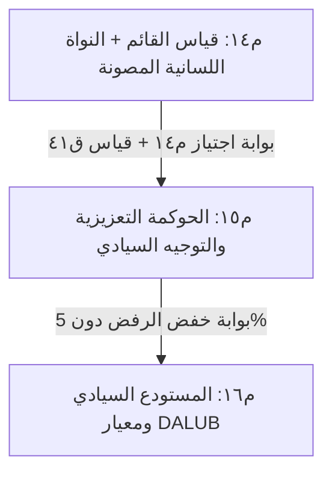

# الخطة التنفيذية المدمجة لمشروع «ديوان» (م١٤ إلى م١٦)
## من حوكمة الحصن الدفاعي إلى السيادة اللغوية والمعرفية

> **توجيه إلزامي للعميل المنفِّذ القادم (سواء كنت Claude Code أو Codex أو غيرهما):**  
> اقرأ [`docs/AGENT-ONBOARD-REFUTE.md`](../docs/AGENT-ONBOARD-REFUTE.md) و[`docs/STUDY-PROMPT.md`](../docs/STUDY-PROMPT.md) **قبل أن تكتب سطراً واحداً**.  
> لا تبدأ بالادعاء، بل ابدأ بالتحقق والنقض. كل دفعة تدفعها يجب أن تحمل وسمك المعتمد في ذيل الـ commit:  
> `Diwan-Agent: vendor/agent`  
> وممنوع كسر أي اختبار من الاختبارات الـ 2,118 القائمة، أو تجاوز قواعد الحوكمة الدستورية (ق١ حتى ق٤٥).

---

## ٠. نقطة الانطلاق الميدانية المثبتة (أين يقف المشروع الآن؟)

- **حالة الشجرة:** نظيفة، ومتزامنة، وكافة الاختبارات خضراء.
- **إجمالي الاختبارات:** **2,118 اختباراً** في `pytest` (اجتازت 100% في 23.4 ثانية).
- **دليل قبول م٠:** `python3 acceptance.py` اجتاز **8/8**.
- **حارس الوثائق:** `tools/check_docs.py --check` يعيد حالة `verified`.
- **المرحلة الصفرية (مُنجزة بالكامل):**
  - تم تحصين حَجر الأوامر المقتبسة في [`core/quoted.py`](../core/quoted.py) عبر خوارزمية التحليل المتوازن للأقواس `_find_balanced_regions`.
  - تم إغلاق ثغرة الهروب بالاقتباس المفرد المتدلي (`»`) المسجلة في برومبت النقض.
  - تم تدعيمها بـ 4 اختبارات عدائية جديدة في [`tests/test_quoted_boundary.py`](../tests/test_quoted_boundary.py) (25/25 اجتازت).

---

## ١. الرؤية الهندسية للخطة المدمجة

تقوم الخطة على الجمع الصارم بين **طموح النقلة النوعية** (تمكين العقل اللساني العربي، التوجيه السيادي، وخفض الرفض) و**دستور ديوان الدفاعي الصلب**:
1. **ق١٩:** لا انتقال لأي مرحلة قبل التأكد من خلو المرحلة الحالية من أي مشكلة.
2. **ق٤١:** لا عقدة تخصصية جديدة قبل قياس القائم.
3. **ق٤٤:** لا تنفيذ لكود برمجي غير موثوق بلا إعلان صريح للمضيف الزائل (`DIWAN_DISPOSABLE_HOST`).
4. **ق٤٥:** لا اعتماد لأي تحكيم بشري دون توقيع Ed25519 بمفتاح المالك الشخصي.



---

## ٢. تفاصيل المراحل التنفيذية

### المرحلة م١٤: استيفاء القياس الدستوري (ق٤١) ودمج النواة اللسانية العربية

#### الهدف:
إغلاق متطلب القياس البشري المعتمد لفك حظر التوسع (ق٤١)، ثم دمج القدرة الصرفية العربية داخل منظومة الفهرسة والبحث دون المساس بحتمية التشفير.

#### مهام التنفيذ خطوة بخطوة:

1. **الخطوة ١.١: قياس بنك م١٤ واستيفاء شرط القرار ق٤١:**
   - تشغيل بنك التشخيص على النموذج المحلي:
     ```bash
     .venv/bin/python tools/evaluate_capabilities.py --suite evaluation/suites/arabic_general_v2.json --provider ollama
     ```
   - استخراج عينة التحكيم البشري وتوليد ملف المراجعة عبر `evaluation/human_review.py`.
   - استدعاء المالك لتوقيع النتائج بمفتاحه عبر `tools/verify_human_verdict.py certify`.
   - **بوابة العبور:** التحقق من خروج صفري لأداة `tools/verify_human_verdict.py verify` لتسجيل الاستيفاء الدستوري لـ ق٤١.

2. **الخطوة ١.٢: بناء مسقط البحث الصرفي العربي (`projections/morphology.py`):**
   - **الموقع المعماري (مُعدَّل بالقرار ق٤٧):** يُوطّن التحليل الصرفي اللغوي الحتمي النقي في `core/linguistics/morphology.py` (خوارزميات صرفية صفرية الاعتماديات خفيفة وحتمية تخدم طبقات النواة والاسترجاع الهجين دون كسر الاعتمادية الأحادية)، بينما يُبنى مسقط الفهرسة والربط بـ SQLite FTS5 داخل `projections/morphology.py` كواجهة إسقاط متخصصة استناداً للنواة (ق٤٧).
   - **الآلية:**
     - تحليل الكلمات إلى: (الجذر الثلاثي/الرباعي، الوزن الصرفي، السوابق، اللواحق).
     - معالجة الجموع التكسيرية والزوائد (كالتعريف وحروف العطف والضمائر المتصلة).
     - توفير جدول افتراضي في SQLite FTS5 بروابط صرفية (Morphological FTS5 Tokenizer / Projection) يربط المشتقات بجذورها.
   - **معايير الأمان والأداء:**
     - يعمل محلياً بالكامل 100% دون أي اتصال شبكي أو استدعاء خارجي.
     - زمن المعالجة والبحث: أقل من 15 ميلي ثانية للاستعلام الواحد.
     - **شرط النقض (Repeal Rule):** إذا أدى المسقط الصرفي إلى كسر الفهرسة الحالية لمخزن `maritime` أو رفع زمن البحث لأكثر من 30ms، يُلغى المسقط فوراً ويُعاد الاعتماد على مسقط FTS5 الأساسي.

3. **الخطوة ١.٣: جناح اختبارات م١٤:**
   - كتابة `tests/test_morphology_projection.py`:
     - اختبار تفكيك المشتقات ("استكتاب"، "مكتبة"، "كاتب" -> جذر: "كتب").
     - اختبار صمود الفهرسة عند البحث بالجذر في مخزن اللوائح البحرية.
     - اختبار عدم ابتلاع الكلمات غير القياسية أو الأعجمية.

---

### المرحلة م١٥: الحوكمة التوليدية المعززة والتوجيه السيادي المتدرج

#### الهدف:
معالجة معضلة سقف الرفض البالغ **35%** الناتجة عن الحظر الصارم في [`core/attribution.py`](../core/attribution.py)، وحل بطء النماذج المحلية (108 ثوانٍ للسياقات الطويلة).

#### مهام التنفيذ خطوة بخطوة:

1. **الخطوة ٢.١: الانتقال من الرفض الأعمى إلى الإصلاح الآلي (Auto-Repair Governance):**
   - **تعديل [`core/attribution.py`](../core/attribution.py):**
     - حالياً: إذا كانت نسبة التطابق اللفظي أقل من `DEFAULT_OVERLAP_FLOOR = 0.34`، يتم إجهاض الإجابة برمز `citation_missing`.
     - الترقية: إضافة دالة `repair_attribution(claim, sources)`:
       - تقوم بالبحث الدلالي والصرفي داخل المصادر المسترجعة عن الشاهد المطابق لمعنى الدعوى.
       - اقتطاع الشاهد الصحيح وإدراجه تلقائياً في الإجابة وتعديل العزو.
       - إذا تعذر العثور على أي سند حقيقي، يُرفض الادعاء برمز مسمّى (الفشل المغلق).
   - **الهدف المقاس:** انخفاض معدل الرفض لما دون **5%** مع الحفاظ على دقة العزو بنسبة 100%.

2. **الخطوة ٢.٢: التوجيه السيادي المتدرج (Tiered Sovereign Routing):**
   - **بناء [`core/router.py`](../core/router.py) المتدرج:**
     - **المستوى الأول (Edge / Local Fast):** نماذج سريعة خفيفة (3B إلى 8B محلياً عبر MLX على Apple Silicon أو vLLM / CPU fallback على بيئات Linux CI وفق ق٣٦):
       - وظيفتها: فحص الحجر، وتصنيف النوايا، واستخراج الكيانات، والإصلاح الصرفي في أقل من ثانيتين.
     - **المستوى الثاني (Sovereign Reasoning Tier):** نماذج الاستدلال الكبرى:
       - تُستدعى فقط للمسائل الفلسفية والاستدلالية والتركيبية المعقدة (مثل استدلال عقدة الفلسفة م١٣-ب).
       - تشفير كامل للبيانات وعزل المفاتيح، مع تسجيل بصمة النداء في السجل المختوم (`core/ledger.py`).

3. **الخطوة ٢.٣: جناح اختبارات م١٥:**
   - كتابة `tests/test_attribution_auto_repair.py`:
     - اختبار إصلاح إجابة تملك المعرفة دون تطابق لفظي حرفي.
     - اختبار الرفض المغلق لدعوى مكذوبة أو غير موجودة في المصادر.
   - كتابة `tests/test_tiered_routing.py`:
     - اختبار تصنيف الطلبات وتوجيه البسيط محلياً والمعقد سيادياً.

---

### المرحلة م١٦: المستودع السيادي ومعيار DALUB الوطني

#### الهدف:
تحرير 33,341 مادة مجمدة في المستودع بالاستناد إلى النظام السعودي، وإطلاق أول معيار تقييم وطني سيادي للذكاء العربي (DALUB).

#### مهام التنفيذ خطوة بخطوة:

1. **الخطوة ٣.١: فرز وتصنيف المخزن المعرفي (تفعيل المادة 4 من نظام المؤلف):**
   - تعديل [`corpus/`](../corpus/) وبوابات القبول:
     - **المسار (أ) - الملكية العامة المطلقة (Statutory Public Domain):**
       - الأنظمة، اللوائح، القرارات الحكومية، الأحكام القضائية، والمعاهدات الرسمية.
       - سندها: **المادة الرابعة من نظام حماية حقوق المؤلف السعودي (المرسوم الملكي م/41)** التي تنص صراحة على سقوط الحماية عنها.
       - الإجراء: تحريرها فوراً وإتاحتها للتوزيع بنسبة 100%.
     - **المسار (ب) - التراث المحمي بانتهاء المدة (Heritage Public Domain):**
       - أمهات كتب اللغة والتراث التي انقضى على وفاة مؤلفيها أكثر من 50 عاماً.
       - عزل التحقيقات والحواشي التجارية المعاصرة في بيئة قراءة مغلقة (`use_internal`) صيانةً للحقوق.

2. **الخطوة ٣.٢: إطلاق معيار DALUB السيادي (`evaluation/suites/dalub_v1.json`):**
   - بناء حزمة من **300 قضية اختبار** موزعة على 5 محاور:
     1. *الصرف والاشتقاق والجذور.*
     2. *التركيب النحوي والإعراب التوليدي.*
     3. *الدلالات اللغوية والتراثية والأنظمة.*
     4. *سلامة العزو ومناعة الاستشهاد.*
     5. *صمود الحجر الاقتباسي ضد محاولات الاختراق.*
   - بناء مُشغل المعيار `tools/evaluate_dalub.py` وإصدار تقرير المطابقة الرسمي.

---

## ٣. بروتوكول العمل للعميل المنفّذ (كيف تبدأ التنفيذ؟)

عند استلامك المهمة، اتبع هذا التسلسل الحتمي:

1. **التحقق من البيئة قبل كتابة أي كود:**
   ```bash
   python3 acceptance.py                          # يجب أن يكون 8/8
   .venv/bin/python tools/check_docs.py --check   # يجب أن يخرج verified
   .venv/bin/python -m pytest tests/test_quoted_boundary.py  # يجب أن يكون 25/25
   ```
2. **ابدأ بمرحلة م١٤ أولاً:**
   - لا تنتقل إلى م١٥ قبل استيفاء بوابة م١٤ كاملة (ق١٩).
   - التزم بتسجيل أي قرار جديد في `docs/DECISIONS.md` وفق النموذج الدستوري الصارم (التاريخ، السند، الواقعة، القرار، الحدود المعلنة، شرط النقض).
3. **قبل كل Commit:**
   - شغل `tools/check_docs.py --write` لتحديث أرقام الوثائق آلياً.
   - تأكد من تضمين ترويسة العميل:
     ```
     Diwan-Agent: <اسم-عميلك>
     ```
   - تأكد من خروج `pytest` كاملاً باللون الأخضر دون أي استثناء.
