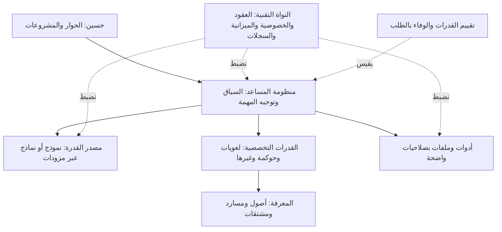

# رؤية ديوان — مساعد عام محوره العربية

**مرجع الهدف: توضيح المالك في ٢١ سبتمبر ٢٠٢٦، والتنفيذ معتمد بقوله «نفذ».**
القرار ق٢٧؛ هذه رؤية المنتج المستهدف، وليست وصفًا لقدرات اكتملت.

> «حسنا للتوضح الهدف النهائي نواه عربية مشابهه في عملها جيميناي انثروبيك و شات جي بي اتي»

## تصوّر المالك

ديوان في المركز، والعقد حوله؛ «سياسات» واحدةٌ منها والبقية تُسمّى بقراره: `docs/vision/diwan-hub.jpg`. والأدوار والقاعدة «ديوان عام؛ والسياسات عقدة» في `AGENTS.md`.

## الهدف

ديوان مساعد ذكاء اصطناعي عام لحسين أولًا، تكون العربية محور جودة
فهمه وتعبيره واستدلاله ونقله للمعرفة. يستقبل محادثة أو مهمة، يحافظ
على سياقها، ويستعين بالمصادر والقدرات التخصصية والأدوات عند الحاجة،
وينتج جوابًا أو عملًا يمكن مراجعته. التشابه المقصود مع فئة المساعدات
العامة وظيفي؛ لا يتضمن ادعاء مساواة منتجات بعينها في الأداء.

المعاجم والبحرية والبحث الموثق تجارب وقدرات داخل هذا الهدف. نجاح
تجربة منها لا يثبت وحده تحقق الرؤية العامة.

## القدرات التي تُبنى وتُقاس

| القدرة | سلوك قابل للملاحظة | مثال إخفاق يجب كشفه |
|---|---|---|
| المحادثة واتباع التعليمات | متابعة السياق والتصحيح والقيود عبر جولات | إعادة معلومة أُلغيَت أو خلط سياق جلستين |
| الفهم العربي | تمييز النفي والشرط والاستثناء ومرجع الضمير والمعنى الاصطلاحي | قلب «إلا» أو إهمال شرط يغيّر الحكم |
| الاستدلال وحل المشكلات | الوصول إلى نتيجة صحيحة مع تعليل موجز وافتراضات معلنة | نتيجة تخالف المعطيات رغم صياغة مقنعة |
| الكتابة والتحرير | نص مناسب للغرض والجمهور يحفظ المطلوب | تحسين الأسلوب مع تحريف المعنى أو إسقاط جزء |
| الترجمة والتعريب | أمانة المعنى والمصطلحات والأرقام والقيود | سقوط نفي أو تغيير إلزام إلى احتمال |
| البرمجة | شرح الشيفرة وصياغة حل قابل للفحص | شيفرة تبدو سليمة ولا تحقق السلوك المطلوب |
| العمل بالمصادر والملفات | التمييز بين الأصل والاستنتاج وربط الادعاء بموضعه | مقتطف موجود لكنه لا يسند كامل الادعاء |
| تنفيذ المهام بالأدوات | اختيار أداة معلومة وصلاحية مناسبة والتحقق من الأثر | إعلان الإنجاز دون نتيجة فعلية أو تنفيذ نص مصدر كتعليمات |
| الصور والصوت | فهم وإنتاج مقيسان وفق نطاق كل واجهة | الادعاء برؤية أو سماع مدخل لم يصل للنظام |

الصور والصوت وتنفيذ الأدوات أهداف لاحقة. الجلسات الدائمة إضافة
م٩ التجريبية؛ بنك التشخيص النصي الأول وحده لا يثبت أيًا من هذه القدرات.

## الهيكل الوظيفي المستهدف

هذا مخطط الهدف. التنفيذ الحالي يملك المزودات وضبط النداء والعقدتين
وخدمات محددة؛ م٩ تضيف جلسات نصية محلية وCLI تجريبيًا وفق ق٢٩،
ولا تحقق وحدها منظومة المساعد الكاملة في الرسم.

## معنيان يجب الفصل بينهما

**النواة العربية بوصفها منتجًا:** مجمل قدرات المساعد وخبرته العربية.
**`core/` بوصفه كودًا:** العقود والحقوق والخصوصية والميزانية والأثر
والاستئناف. لا يكتسب النموذج فهمًا جديدًا بمجرد تنظيم هذه المكونات.

يوجد حاليًا في `core/attribution.py` حارس تداخل معجمي وأرقام، بحدود
موثقة في ق٢٦. هو قرينة محدودة للمحتوى المسند؛ لا يحكم بصحة المعنى
ولا يُعمم على القصيدة أو الحديث العام أو النتيجة الحسابية.

## المحادثة والمعرفة المسندة

في م٩ أضيف عقد مستقل للجلسة والجولة والمخرج، يمر بضوابط النداء
القائمة. الشرح العام والمسودة والإبداع والاقتراح لا تحتاج مصادر
مصطنعة، وتظهر صفتها للمستخدم. المخرج غير المتحقق لا يكتسب وصف
«معرفة موثقة» تلقائيًا.

تبقى `KnowledgeItem` وعقود الأصول والحقوق والإسناد نافذة عند إدخال
مادة إلى المخزن أو تقديم جواب بوصفه مبنيًا على مصادر. ويُعلَن في
الجواب المركب ما نُقل، وما استُنتج، وما لم يتوفر له دليل.
عدم فرض شاهد على الإبداع لا يخفف واجب الصدق في الادعاءات الواقعية.

## مصدر القدرة قرار مستقل

تبدأ القياسات بالمزود المحلي القائم دون التزام بمعرّف نموذج داخل
البنك. بعد قياس مواضع العجز تُقارن خيارات إعداد النموذج القائم،
أو تخصيص نموذج متاح، أو تدريب خاص بدراسة بيانات وحقوق وموارد.
هذه الدفعة لا تختار أوزانًا جديدة ولا تنفذ تدريبًا أو شراءً أو
خدمة دائمة. رفع الأداء نتيجة تُقاس؛ تغيير المزوّد ليس تقدمًا بذاته.

ذاكرة الحوار، وتفضيلات المالك، والمكتبة، وتدريب الأوزان أربع آليات
مختلفة. حفظ تفضيل أو إضافة مصدر ليس تدريبًا، وتصحيح جواب لا يصير
حقيقة دائمة دون مسار اعتماد واضح.

## تعريف النجاح

النجاح يُقاس بما أُنجز من طلب حسين الأصلي، لا بعدد المكونات أو
الجبهات التي اختارها مخطط النظام. تُقاس صحة المعنى والإسناد
والتغطية والعربية، والامتناع المبرر، ووقت المراجعة والتصحيح والكلفة.
لا تعوض درجة أسلوب مرتفعة خطأ جوهريًا في المعنى أو الخصوصية.

نقارن المسار المركب بمسار مباشر مضبوط بالمزود والمواد والميزانية
نفسها، ونفصل أثر الاسترجاع عن أثر التأليف والتنسيق. الفائدة قد تكون
صحة أفضل أو مراجعة أسهل أو ضمانًا مطلوبًا، ويُسمى كل مكسب باسمه.

التشخيصات العلنية تكشف أخطاء وتوجه الإصلاح. القبول المستقل والاستخدام
الفعلي المتكرر يختبران التعميم والمنفعة. لا تتحول حالات التطوير
المكشوفة إلى شهادة جاهزية للمساعد العام.

## صلة الوثائق

- `ARCHITECTURE.md`: حدود الطبقات وعقودها، والمبني مقابل المستهدف.
- `ROADMAP.md`: مراحل المساعد العام وبوابات الانتقال.
- `CAPABILITY-EVALUATION.md`: بروتوكول التشخيص والمقارنة والقبول.
- `DECISIONS.md`: ق٢٧ يثبت هذا التوضيح ويكمل ق٢٠ دون إسقاط ضوابطه.
